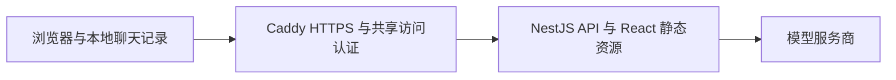

# 容器部署与发布恢复

交付目标是可部署的单实例 AI 对话应用：React 静态资源与 NestJS API 放在同一镜像中；本机通过回环端口验收，服务器通过 Caddy 提供 HTTPS 和共享演示口令。聊天记录仍在浏览器 IndexedDB 中。

本文介绍独立 Caddy 网关方案。已上线的 `chat.herong.info` 复用服务器现有 Nginx，按演示需要开放访问；其端口、证书和发布方式见 [Nginx 部署说明](Nginx部署说明.md)，不要同时启动两个网关占用 80/443 端口。



这套交付覆盖部署和运行闭环，没有账户、服务端会话归属、跨设备同步、计费与分布式配额。共享口令只控制演示入口，不能代替用户体系。当前没有服务端数据库，因此不为容器部署额外引入 MySQL、Redis 或 Kubernetes。

## 一、本机启动

准备 Docker Engine / Docker Desktop 和 Docker Compose 2.30+；后者用于 `env_file.format: raw`。以下命令均在仓库根目录执行。已有配置时直接编辑，保留原文件。

```bash
cp deploy/.env.example .env.deploy
docker compose --env-file .env.deploy -f compose.yaml -f compose.local.yaml up -d --build --wait
curl --fail http://127.0.0.1:3001/api/healthz
```

打开 `http://127.0.0.1:3001`，无模型密钥时可完成本地附件演示。只发布 `127.0.0.1:3001`，没有局域网或公网访问能力。`.env.deploy` 的 `APP_LOCAL_PORT` 改动时，也要同步 `APP_ORIGIN` 的端口；`localhost` 和 `127.0.0.1` 是不同的浏览器存储来源，请固定一个地址。

需要远程模型时，创建 `.env.runtime` 并填入 `.env.example` 中的厂商 Key、Base URL 和模型列表，权限设为 `600`。不要给变量加 `VITE_` 前缀。Compose 以运行环境注入，镜像不包含这些文件；`format: raw` 不会解释密钥中的 `$`。容器中不可把 `127.0.0.1` 当作宿主机上的模型服务。

```bash
chmod 600 .env.runtime
docker compose --env-file .env.deploy -f compose.yaml -f compose.local.yaml up -d --force-recreate --wait
```

开发模式 `npm run dev` 继续加载 `.env.local` / `.env`。`npm start` 的生产入口只读取运行环境；直接在本机使用环境文件启动生产构建时，显式执行 `node --env-file=.env.local dist/server/index.js --production`，不再隐式加载个人开发密钥。

## 二、镜像与运行边界

| 项目       | 行为                                                                           |
| ---------- | ------------------------------------------------------------------------------ |
| 镜像       | Node 22 Debian slim，多阶段构建，固定官方镜像摘要；`npm ci` 使用锁文件         |
| 构建上下文 | 白名单输入，不发送 `.git`、环境文件、课程、历史报告与宿主机依赖                |
| 运行内容   | 生产依赖、前后端构建产物、第三方许可证；不含 `tsx` / TypeScript 和业务源码目录 |
| 权限       | 应用以 `node` 用户运行，只读根文件系统、临时目录、移除 capabilities、禁止提权  |
| 资源起点   | 应用 1 CPU / 512 MiB、Node 堆上限 384 MiB；网关 256 MiB，需结合实测调整        |
| 运行保障   | init 转发信号，20 秒停止窗口，进程退出重启，日志每份 10 MiB、保留 3 份         |
| 健康检查   | `/api/healthz` 表示应用已初始化；不调用模型、不消耗额度，不代表上游可用        |
| 日志       | JSON 请求编号、状态、耗时与首字耗时；不记录正文、图片或 API Key                |

Docker 的 `unhealthy` 状态本身不会触发 `restart` 策略；发布脚本会拒绝不健康的新版本。运行期需由运维监控健康状态并处理，不能把重启策略当作完整告警系统。

| 配置                         | 默认值与含义                                       |
| ---------------------------- | -------------------------------------------------- |
| `PORT`                       | 3001；Compose 固定内部端口，外部端口独立配置       |
| `APP_BIND_ADDRESS`           | 原生运行默认 `127.0.0.1`，容器为 `0.0.0.0`         |
| `APP_ORIGIN`                 | 指定后精确匹配协议、主机和端口；非回环监听必须配置 |
| `APP_CHAT_TIMEOUT_MS`        | 120000，允许 1–600000；超时取消上游并返回受控错误  |
| `APP_MAX_ACTIVE_GENERATIONS` | 8；每个应用进程同时生成的上限，不是注册用户上限    |

`APP_ORIGIN` 不是鉴权。命令行等无 Origin 的客户端仍可请求 API，公网访问控制由 Caddy 承担。生成达到上限时，在 SSE 响应头发出之前返回 JSON 429 和 `Retry-After: 1`，不排入无限队列，不自动重试付费生成。完成、停止、异常、超时和校验失败均释放名额。

默认 8 路是保护性配置，不是性能结论。提高到 50、500 或更多之前，需使用模拟上游压测首字延迟、错误率、内存、事件循环和连接数，并核对真实模型限额和成本。

## 三、服务器与 HTTPS

准备 Linux 主机、已指向服务器的域名以及入站 TCP 80 / 443。应用 3001 不开放公网。生产只组合 `compose.yaml` 与 `compose.production.yaml`，不要叠加本机端口配置。

在 `.env.deploy` 设置 `SITE_HOST`（纯域名）、`ACME_EMAIL`、经过测试的 `APP_IMAGE` 和运行配置文件路径。生产组合会自动把 `APP_ORIGIN` 设为 `https://SITE_HOST`。

生成共享口令的哈希，命令交互输入口令，避免把真实口令写入命令历史：

```bash
mkdir -p .secrets
chmod 700 .secrets
docker run --rm -it --entrypoint caddy caddy:2-alpine@sha256:5f5c8640aae01df9654968d946d8f1a56c497f1dd5c5cda4cf95ab7c14d58648 hash-password
```

将得到的哈希放入 `.secrets/demo-auth.caddy`，内容为一行 `demo 哈希值`，再设置 `chmod 600 .secrets/demo-auth.caddy`。文件由 Compose secret 挂载，认证适用于页面和 API。Caddy 会申请和续期证书，证书状态保存在 `caddy_data` / `caddy_config` 卷，备份时限制访问权限。共享口令泄露时重新生成哈希并重建网关。

本机验收使用相同的 `deploy/app.caddy` 代理策略；测试入口是回环 HTTP，生产入口启用真实 HTTPS。SSE 根据 `text/event-stream` 及时刷新，**不设置 `flush_interval -1`**，以保留客户端断开时的上游取消。没有开启生成 POST 的代理重试；流超时 11 分钟，大于应用允许的最长 10 分钟。网关与应用均限制请求体为 20 MiB。

## 四、版本发布与回滚

正式构建应使用干净、已提交的代码版本。Linux x86 服务器选择 `linux/amd64`，ARM 服务器选择 `linux/arm64`；Mac 本机构建成功不等于另一架构已经验证。

```bash
git status --short
RELEASE_REVISION=$(git rev-parse HEAD)
docker buildx build --platform linux/amd64 --load --build-arg APP_REVISION="$RELEASE_REVISION" -t "zhixu-chat:$RELEASE_REVISION" .
CONTAINER_TEST_IMAGE="zhixu-chat:$RELEASE_REVISION" npm run test:container
```

通过后传递同一个镜像：使用自己的私有镜像仓库推送并在服务器拉取，或使用 `docker save` / `docker load`。不要在服务器重新构建同名版本。容器浏览器验收需要先安装匹配的 Chromium；本机已有 Chrome 时加上 `PLAYWRIGHT_CHANNEL=chrome`。部署机器需要 Node 22+ 执行发布脚本，无需安装项目 npm 依赖。

验收中的故障镜像按被测镜像的 OS、架构和变体构建，避免在 ARM 开发机验证 amd64 发布镜像时错误地寻找 ARM 基础层。跨架构运行仍要求 Docker 环境具备相应的模拟执行能力。

```bash
# 在目标服务器，替换为已加载或已拉取的版本引用
npm run deploy -- production zhixu-chat:版本号 .env.deploy
# 恢复上一次成功发布前的镜像
npm run deploy -- production --rollback .env.deploy
```

发布脚本先静默校验 Compose 和 Caddy 配置，再解析镜像为不可变的本地 image ID，等待应用健康，并检查公网 HTTPS 入口返回预期的 401 认证状态。通过后将当前/上一版 image ID 写到 `output/deploy/zhixu-production/state.json`。失败时恢复旧镜像并重新检查健康；首次发布失败则停止应用。发布锁防止同一目录内同时发布。

回滚针对**应用镜像**，配置文件、域名、访问口令和 Caddy 配置应作为独立变更备份与验证。升级网关基础镜像也要单独安排。保留上一版镜像，不要在回滚窗口执行镜像清理；更換服务器或发布目录时一并保留发布状态文件。`.env.deploy` 内的 `APP_IMAGE` 也要在发布后记录为选定版本；后续发布统一走脚本，避免手动 `compose up` 切回旧配置中的标签。

单实例更新和回滚会中断正在生成的回答。收到的内容由客户端保留，用户可重新生成；当前不承诺零停机。浏览器 IndexedDB 不随镜像回滚，包含存储格式变更的版本必须另外确认向后兼容性，必要时先导出对话。旧页面请求已删除的旧版懒加载资源时可能需要刷新。

## 五、运行检查与数据恢复

```bash
docker compose --project-name zhixu-production --env-file .env.deploy -f compose.yaml -f compose.production.yaml ps
docker compose --project-name zhixu-production --env-file .env.deploy -f compose.yaml -f compose.production.yaml logs --tail=100 app
docker compose --project-name zhixu-production --env-file .env.deploy -f compose.yaml -f compose.production.yaml logs --tail=100 gateway
```

用界面错误详情中的请求编号关联应用日志；先区分请求拒绝、模型超时、额度不足、用户取消和服务退出，再决定处理方式。不要使用会输出完整密钥的 `docker inspect` 环境列表或完整 `compose config` 分享问题，配置检查使用 `config --quiet`。

应用无服务端聊天数据卷。容器重建不会删除同一浏览器、同一来源的聊天记录；换设备、清理浏览器数据或更换协议/域名/端口都不能自动迁移，使用会话导出留存资料。服务器备份范围是配置、运行凭据、证书卷、镜像版本与发布状态，不是浏览器聊天记录。

## 六、可重复验收

```bash
npm run check
npm run test:e2e
npm run container:build
npm run test:container
```

容器验收启动独立 Compose 项目和模拟上游，只暴露临时回环端口，既不读取个人 `.env.local` / `.env.runtime`，也不调用真实模型。它验证镜像运行约束、入口认证、来源校验、静态资源、实际 SSE 首块、停止穿透代理、429、超时、上游错误、20 MiB 限制、日志脱敏、重启和不健康镜像的自动回滚；真实浏览器另外验证经认证生成，以及同源重启和回滚后正文、草稿的恢复。结束后清理本次容器、网络和临时镜像。

结果写入 `output/container/report.json`；失败诊断写入 `output/container/failure.log`。CI 在原有检查之后构建镜像并执行同一验收，仅上传报告，不自动推送镜像或部署公网。实际执行结果见 [试岗交付说明](试岗交付说明.md)。

参考：[Docker 多阶段构建](https://docs.docker.com/build/building/multi-stage/)、[Compose 健康依赖](https://docs.docker.com/compose/how-tos/startup-order/)、[Docker 重启策略](https://docs.docker.com/engine/containers/start-containers-automatically/)、[Caddy 自动 HTTPS](https://caddyserver.com/docs/automatic-https)、[Caddy 认证](https://caddyserver.com/docs/caddyfile/directives/basic_auth)、[Caddy 流式代理](https://caddyserver.com/docs/caddyfile/directives/reverse_proxy#streaming)。
