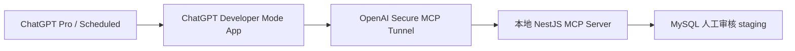
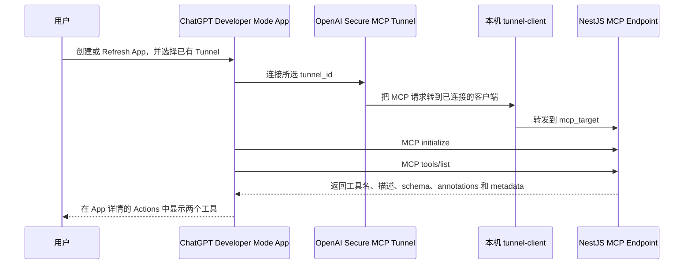
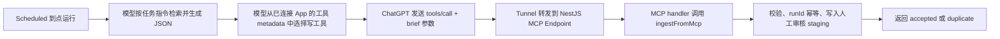

# ChatGPT Scheduled + Secure MCP Tunnel 个人操作手册

这份手册面向第一次接触这条链路的人，也作为“码圈一分钟”当前个人 Canary 环境的日常运维说明。

目标是让 ChatGPT Scheduled 在后台生成 `maquan-scheduled-brief-v1` JSON，并通过私有 MCP 工具提交到项目的人工审核 staging。它不会自动发布首页，不会自动审核，也不会自动创建 Train / Eval Gold。

## 1. 先理解五层关系



| 名称 | 作用 | 改 MCP 工具时是否重建 |
| --- | --- | --- |
| ChatGPT Pro | 运行 Scheduled 和 ChatGPT 会话 | 否 |
| Runtime API Key | 让 `tunnel-client` 连接 OpenAI Tunnel 控制面 | 否 |
| `tunnel_id` | 标识已经创建的 Secure MCP Tunnel | 否 |
| Developer Mode App | ChatGPT 中看到的“码圈一分钟·入库测试” | 通常只 Refresh；刷新入口缺失时才重建 App |
| MCP 工具 | NestJS 服务通过 `tools/list` 暴露的能力 | 改后重启后端并 Refresh App |
| Scheduled 任务 | 决定何时搜索、生成 JSON 和调用 MCP | 调试和正式阶段可分别创建或调整 |

最容易混淆的是：

- API Key 不是工具；
- App 名也不是工具名；
- App 卡片只显示“码圈一分钟·入库测试”，进入详情后才会看到工具；
- 工具名由 NestJS MCP Server 决定。

当前应看到两个工具：

```text
get_maquan_connection_status
submit_maquan_scheduled_brief_for_review
```

其中：

- `get_maquan_connection_status`：只读连接检查，不访问审核数据库，不产生入库记录；
- `submit_maquan_scheduled_brief_for_review`：写入人工审核 staging，按 `runId` 幂等，不发布、不审核、不创建 Gold；输入和输出都提供 JSON Schema，便于 Scheduled 稳定识别 accepted、duplicate 和安全错误。

### 1.1 ChatGPT 是怎样发现这两个工具的

先记住结论：ChatGPT 不会扫描本机端口、Git 仓库、NestJS 代码或数据库；提示词也不能创建 MCP 工具。工具发现发生在“创建或 Refresh Developer Mode App”时。



对本项目来说，完整发现链路是：

1. NestJS 通过 MCP SDK 的 `server.registerTool(...)` 注册两个工具；
2. NestJS 把 MCP 协议端点暴露在 `POST /api/v1/external-teacher/mcp`；
3. `maquan-local` profile 的 `mcp_target` 指向这个本地地址；
4. `tunnel-client run --profile maquan-local` 主动建立到 OpenAI Secure MCP Tunnel 的连接；
5. 在 ChatGPT 创建 App 时选择这个 Tunnel，相当于把 App 与该转发通道关联起来；
6. ChatGPT 通过通道完成 MCP 初始化并发出 `tools/list`；
7. NestJS MCP SDK 根据 `registerTool` 返回两个工具的定义；
8. ChatGPT 保存这份 App metadata，App 详情中的 `Actions` 就来自这次返回；
9. 后端以后新增、删除或修改工具时，重启后端并点击 `Refresh`，ChatGPT 才会重新读取 `tools/list`。

本项目已经用 HTTP 集成测试验证了这三个协议动作：

```text
initialize -> tools/list -> tools/call
```

因此，ChatGPT 详情页里出现 `get_maquan_connection_status`，不是因为 Scheduled 提示词里写了这个名字，而是因为后端已经注册它，ChatGPT 在创建或 Refresh App 时通过 `tools/list` 读到了它。

### 1.2 到点运行时，ChatGPT 怎样调用工具

“发现工具”和“调用工具”是两件事：



模型决定是否使用工具时，主要能看到并利用：

- App 的 Name 和 Description；
- 工具的 name、title 和 description；
- input schema 与 output schema；
- `readOnlyHint`、`destructiveHint`、`idempotentHint`、`openWorldHint` 等 annotations；
- 当前 Scheduled 提示词对调用时机、参数和次数的明确要求；
- 用户为该 App 选择的 Permissions。

提示词的职责是要求模型在正确时间选择正确工具、传入完整 `brief` 并且只调用一次。它不能让一个后端未注册的工具凭空出现，也不能替代 schema、权限或后端校验。

### 1.3 后端必须做哪些事情

| 后端职责 | 本项目实现 | 为什么需要 |
| --- | --- | --- |
| 提供 MCP HTTP 入口 | `scheduled-brief-mcp.controller.ts` | 接收 MCP JSON-RPC 请求，并交给 Streamable HTTP transport |
| 注册和声明工具 | `scheduled-brief-mcp.server.ts` 中的 `server.registerTool(...)` | 让 `tools/list` 能返回可发现的工具定义 |
| 提供清晰 metadata | name、title、description、input/output schema、annotations、`_meta` | 让模型正确选工具、正确传参，并让 ChatGPT 进行权限判断和状态展示 |
| 实现只读探针 | `get_maquan_connection_status` | 创建任务前可以验证连通性且不产生数据库记录 |
| 实现受限写入 | `submit_maquan_scheduled_brief_for_review` | 只接收完整 `maquan-scheduled-brief-v1` 并进入人工审核 staging |
| 做业务校验 | `ScheduledBriefService.ingestFromMcp(...)` 及 brief contract | 拒绝错误 taskName、超限请求、非法 JSON 和不符合约束的数据 |
| 做幂等保护 | 以 `runId` 去重 | Scheduled 重试时不重复入库 |
| 限制副作用 | 不发布、不自动审核、不创建 Gold、不删除历史 | 保持 External Teacher 只能进入人工审核闭环 |
| 返回结构化结果 | accepted / duplicate / 安全错误的 output schema | 让 Scheduled 能保存真实的 `ingestId`、状态和失败原因 |
| 提供测试和诊断 | 覆盖 `initialize`、`tools/list`、`tools/call`，并检查 Tunnel `readyz` | 区分工具未注册、后端未启动、Tunnel 未连接和 App metadata 缓存问题 |

本项目的关键代码位置：

```text
apps/backend/src/modules/external-teacher/scheduled-brief-mcp.controller.ts
apps/backend/src/modules/external-teacher/scheduled-brief-mcp.server.ts
apps/backend/src/modules/external-teacher/scheduled-brief.service.ts
apps/backend/src/modules/external-teacher/scheduled-brief.contract.ts
apps/backend/src/modules/external-teacher/scheduled-brief-mcp.server.spec.ts
```

安全边界也要分清：当前 Canary 的 MCP 工具声明为 `noauth`，但本地 MCP 地址不能直接暴露到公网；外部访问必须经过已经认证的 Secure MCP Tunnel。生产化时还要重新评估认证、部署常驻性、密钥轮换、限流和审计日志。

## 2. 本项目当前固定值

| 项目 | 当前值 |
| --- | --- |
| 仓库目录 | `/Users/ronnie/Documents/my-project/maquanyifenzhong/maquanyifenzhong` |
| Docker Compose project | `maquan-mcp-canary` |
| 环境文件 | `.env.dev` |
| 本地 MCP URL | `http://127.0.0.1:3000/api/v1/external-teacher/mcp` |
| Tunnel profile | `maquan-local` |
| Tunnel 健康页 | `http://127.0.0.1:8080/readyz` |
| ChatGPT App 名 | `码圈一分钟·入库测试` |
| brief 内固定 taskName | `码圈一分钟·程序员分时情报` |
| 正式提示词 | `apps/deepseek-web-teacher-collector/prompts/chatgpt-scheduled-maquan-brief-v1-setup.txt` |

`tunnel_id` 和 Runtime API Key 不写进这份可分享文档。`tunnel_id` 可以从 Platform Tunnel 页面或本机 profile 查看；API Key 不得发到聊天、截图、Git、Scheduled Prompt 或他人教程中。

## 3. 费用边界

ChatGPT Pro 与 OpenAI API Platform 是两套独立计费系统。

本手册这条链路没有调用 Responses API、Chat Completions API 等模型 API：

```text
ChatGPT Scheduled 负责推理和搜索
Runtime API Key 只用于 tunnel-client 连接 Tunnel 控制面
MCP 工具调用进入自己的 NestJS 和 MySQL
```

因此看到“API 余额为 0”或“Go to Billing”的通用弹窗时，不需要为了本地 Tunnel Canary 立即充值。只有以后改成 `NestJS Cron + OpenAI Responses API` 时，才需要单独购买 API credits。

不要因为新增 MCP 工具而重新创建 API Key。只有 Key 泄漏、遗失、被撤销或组织权限变化时才轮换。

## 4. 第一次准备本地后端

### 4.1 打开 Docker Desktop

等待 Docker 状态变成 Running，然后执行：

```bash
docker info >/dev/null && echo "Docker ready"
```

必须看到：

```text
Docker ready
```

### 4.2 准备 `.env.dev`

首次运行：

```bash
cd /Users/ronnie/Documents/my-project/maquanyifenzhong/maquanyifenzhong
cp .env.prod.example .env.dev
chmod 600 .env.dev
```

`.env.dev` 已被 `.gitignore` 忽略，不要强制提交。

至少确认：

```dotenv
PORT=3000
NODE_ENV=development
EXTERNAL_TEACHER_MCP_ENABLED=1
EXTERNAL_TEACHER_MCP_ALLOW_NO_AUTH=1
EXTERNAL_TEACHER_MCP_BEARER_TOKEN=
EXTERNAL_TEACHER_MCP_MAX_BRIEF_BYTES=90000
RUN_MIGRATIONS=false
```

数据库、Redis、RabbitMQ、JWT 和管理员密码使用仅供本地开发的随机值。`ALLOW_NO_AUTH=1` 只允许用于 OpenAI Secure MCP Tunnel Canary；不要把这个端点直接暴露到公网。

### 4.3 启动依赖和后端

```bash
cd /Users/ronnie/Documents/my-project/maquanyifenzhong/maquanyifenzhong

docker compose \
  --env-file .env.dev \
  -p maquan-mcp-canary \
  -f docker-compose.dev.yaml \
  up -d db redis rabbitmq qdrant model-api

docker compose \
  --env-file .env.dev \
  -p maquan-mcp-canary \
  -f docker-compose.dev.yaml \
  up -d backend
```

检查：

```bash
docker compose \
  --env-file .env.dev \
  -p maquan-mcp-canary \
  -f docker-compose.dev.yaml \
  ps
```

数据库、Redis、RabbitMQ 和 model-api 应为 healthy，backend 应为 Up。

### 4.4 首次建立审核表

迁移脚本是幂等的，可以重复执行：

```bash
docker compose \
  --env-file .env.dev \
  -p maquan-mcp-canary \
  -f docker-compose.dev.yaml \
  exec -T db sh -lc \
  'mysql -u"$MYSQL_ROOT_USER" -p"$MYSQL_ROOT_PASSWORD" "$MYSQL_DATABASE"' \
  < database/migrations/manual-20260713-add-scheduled-brief-review.sql
```

验证：

```bash
docker compose \
  --env-file .env.dev \
  -p maquan-mcp-canary \
  -f docker-compose.dev.yaml \
  exec -T db sh -lc \
  'mysql -u"$MYSQL_ROOT_USER" -p"$MYSQL_ROOT_PASSWORD" "$MYSQL_DATABASE" -e \
  "SHOW TABLES LIKE '\''scheduled_brief_%'\'';"'
```

预期三个表：

```text
scheduled_brief_ingests
scheduled_brief_candidates
scheduled_brief_quarantines
```

### 4.5 检查本地 MCP 路由

```bash
curl -i http://127.0.0.1:3000/api/v1/external-teacher/mcp
```

预期是 `405 Method Not Allowed`。这是正确结果：说明 MCP 路由存在，但 GET 不是协议调用方式。

常见异常：

- `404`：`EXTERNAL_TEACHER_MCP_ENABLED` 没有生效；
- `401`：当前配置要求 Bearer Token；
- 连接失败：backend 没启动或 3000 端口不可达；
- `500`：查看 backend 日志。

查看日志：

```bash
docker compose \
  --env-file .env.dev \
  -p maquan-mcp-canary \
  -f docker-compose.dev.yaml \
  logs --tail=160 backend
```

## 5. 第一次创建 Secure MCP Tunnel

如果 Tunnel 已经存在，整个第 5 节跳过，直接进入第 6 节。

### 5.1 创建 Tunnel

打开：

- Platform Tunnel settings：<https://platform.openai.com/settings/organization/tunnels>

操作：

1. 选择与 ChatGPT 登录对应的 organization；
2. 创建 Tunnel，例如命名 `maquan-local-canary`；
3. 关联实际使用 Scheduled 的 workspace；
4. 保存页面给出的 `tunnel_id`；
5. 按 Tunnel 页面入口创建一把专用 Runtime API Key。

个人 Canary 可以使用个人拥有的专用 Key。不要复用生产系统 Key，也不要把 Key 写进项目 `.env.dev`、提示词或 Git。

### 5.2 安装 `tunnel-client`

优先使用 Platform Tunnel 页面提供的下载方式。安装后验证：

```bash
tunnel-client --version
tunnel-client help quickstart
```

### 5.3 初始化本机 profile

如果需要临时输入 Runtime API Key：

```bash
read -s "CONTROL_PLANE_API_KEY?粘贴 Runtime API Key（不会显示）: "
export CONTROL_PLANE_API_KEY
echo
```

初始化：

```bash
tunnel-client init \
  --profile maquan-local \
  --tunnel-id '<你的 tunnel_id>' \
  --mcp-server-url 'http://127.0.0.1:3000/api/v1/external-teacher/mcp'
```

本机 profile 位于：

```text
~/.config/tunnel-client/maquan-local.yaml
```

它可能保存 Runtime API Key，因此必须：

```bash
chmod 600 ~/.config/tunnel-client/maquan-local.yaml
```

不要上传、转发或截图该文件。

## 6. 每次启动 Tunnel

先确保 Docker backend 已经启动并且本地 GET 返回 405。

诊断：

```bash
tunnel-client doctor --profile maquan-local --explain
```

关键检查应当通过：

```text
profile_load
tunnel_id
control_plane_api_key
mcp_target
mcp_server_reachable
health_listener
```

然后运行：

```bash
tunnel-client run --profile maquan-local
```

这个终端窗口需要保持运行。另开终端检查：

```bash
curl -fsS http://127.0.0.1:8080/readyz
```

预期：

```text
ready
```

如果希望 Mac 调试期间不要休眠，可另开终端：

```bash
caffeinate -dimsu
```

结束时按 `Ctrl+C`。

## 7. 第一次创建 ChatGPT Developer Mode App

### 7.1 打开 Developer Mode

在 ChatGPT 设置中打开 Developer Mode，然后进入：

- <https://chatgpt.com/plugins>

### 7.2 创建 App

点击右上角 `+`：

```text
Name：码圈一分钟·入库测试
Description：把码圈一分钟 Scheduled 生成的完整 JSON 提交到人工审核队列；不得发布、审核、删除或创建 Gold。
Connection：Tunnel
Tunnel：选择 maquan-local-canary 或对应的 tunnel_id
```

这条 Canary 不选择 OAuth 或 Mixed Auth。Runtime API Key 由 `tunnel-client` 使用，不填进 ChatGPT App 表单。

创建成功后，App 详情应显示：

```text
get_maquan_connection_status
submit_maquan_scheduled_brief_for_review
```

App 列表卡片仍只显示：

```text
码圈一分钟·入库测试
```

这是正常现象。

### 7.3 Permissions 选择

在 App 的 Permissions 页面保持默认：

```text
Allow low-risk actions
```

不要选择：

- `Always ask`：所有读取和写入都询问，会破坏 Scheduled 无人值守；
- `Allow read actions`：只读连接检查可以自动执行，但正式 staging 入库仍会要求人工确认；
- `Allow all actions`：权限过宽，本项目不需要承担该 elevated risk。

`Allow low-risk actions` 仍保留 ChatGPT 的安全判断：系统可以自动批准低风险动作，也可以拒绝涉及敏感信息的动作。当前写工具已声明 `readOnlyHint=false / destructiveHint=false / idempotentHint=true / openWorldHint=false`，且只能写入私有人工审核 staging，因此这是本项目调试和后续 Scheduled 运行的合适选择。

该设置不能替代真实 Canary；如果计划运行仍停在确认界面，应按“不具备当前无人值守权限”处理，而不是改成 `Allow all actions` 绕过。

## 8. MCP 工具变化后怎样刷新 App

只要修改了工具列表、工具名称、描述、输入输出 schema 或 annotations，都要执行：

1. 重新构建或重启 NestJS backend；
2. 确认本地 MCP 路由返回 405；
3. 确认 Tunnel `/readyz` 返回 `ready`；
4. 打开 <https://chatgpt.com/plugins>；
5. 点击“码圈一分钟·入库测试”卡片或右侧 `...` 进入详情；
6. 点击 `Refresh`；
7. 核对工具列表。

这是 OpenAI 官方推荐的 Developer Mode App metadata 刷新流程。

只改 TypeScript MCP 代码时可执行：

```bash
docker compose \
  --env-file .env.dev \
  -p maquan-mcp-canary \
  -f docker-compose.dev.yaml \
  restart backend
```

如果修改了依赖、Dockerfile 或镜像内容，则执行：

```bash
docker compose \
  --env-file .env.dev \
  -p maquan-mcp-canary \
  -f docker-compose.dev.yaml \
  up -d --build backend
```

等本地 MCP GET 再次返回 405 后，才去 ChatGPT 点击 Refresh。

如果没有 `Refresh`，或者刷新后仍只显示旧工具：

1. 只删除 ChatGPT 中的“码圈一分钟·入库测试”App；
2. 不删除 Tunnel；
3. 不删除 Runtime API Key；
4. 不重新运行 `tunnel-client init`；
5. 点击 `+`，使用同一个 Tunnel 重建同名 App；
6. 再检查两个工具。

除非 Key 泄漏或 Tunnel 本身损坏，否则不要从 Platform 层重新开始。

## 9. 创建 Scheduled 任务前的连接检查

最新正式提示词已允许创建阶段调用：

```text
get_maquan_connection_status
```

正确返回：

```json
{
  "schemaVersion": "maquan-connection-status-v1",
  "status": "ready",
  "service": "maquan-scheduled-brief-review-ingest",
  "acceptedBriefSchema": "maquan-scheduled-brief-v1",
  "writeTool": "submit_maquan_scheduled_brief_for_review",
  "storageWritePerformed": false,
  "requiresHumanReview": true,
  "published": false,
  "goldCreated": false
}
```

创建阶段禁止调用写工具。只有 Scheduled 真正到点、搜索和 JSON 校验完成后，才调用：

```text
submit_maquan_scheduled_brief_for_review
```

## 10. 调试任务怎么安排

### 10.1 先做一次性 Canary

不要一开始启用每天五次。先选一个距离当前至少 20 分钟的时间，创建一次性任务。

使用完整提示词：

```text
apps/deepseek-web-teacher-collector/prompts/chatgpt-scheduled-maquan-brief-v1-setup.txt
```

在完整提示词末尾追加创建方式覆盖，例如：

```text
【本次调试创建方式覆盖】

本次不要创建长期循环任务，只创建一个全新、独立、启用的一次性任务。
任务名称：码圈一分钟·真实内容Canary-<HHmm>
执行时间：<YYYY-MM-DD HH:mm:00>
时区：Asia/Shanghai
只执行一次，不立即执行，不修改任何现有正式任务。

创建前只允许调用一次 get_maquan_connection_status。
只有 status=ready 且 storageWritePerformed=false 才能创建。
创建阶段禁止调用 submit_maquan_scheduled_brief_for_review。

任务到点后，按完整提示词搜索、核验、生成 JSON；最终校验通过后只调用一次 submit_maquan_scheduled_brief_for_review。
```

非正式时点还要明确使用真实时点生成 `scheduledAt` 和 `runId`，不要占用未来正式时点的 runId。

### 10.2 连续调试频率

当前账号实测不接受同一任务每半小时运行。官方支持自定义 RRULE，但没有承诺本账号的最小间隔。

推荐：

```text
一次性 Canary
→ 成功后临时每小时一次
→ 连续三个不同计划时点成功
→ 删除调试任务
→ 创建正式每天五次任务
```

临时每小时示例：

```text
RRULE:FREQ=HOURLY;BYMINUTE=40
```

不要用两个任务错开半小时模拟半小时频率，否则会增加窗口重叠、重复检索、runId 和停用管理风险。

## 11. 正式任务配置

连续三次真实内容 Canary 通过后，再创建唯一正式任务：

```text
任务名称：码圈一分钟·程序员分时情报
时区：Asia/Shanghai
执行时间：每天 05:40、11:40、17:40、20:40、23:40
RRULE:FREQ=DAILY;BYHOUR=5,11,17,20,23;BYMINUTE=40
```

完整创建提示词仍使用：

```text
apps/deepseek-web-teacher-collector/prompts/chatgpt-scheduled-maquan-brief-v1-setup.txt
```

同一正式时点只能有一个启用中的任务，避免两个任务生成相同 `runId`。

## 12. 如何验收入库结果

### 12.1 Scheduled 页面

检查：

- 是否按时启动；
- 是否完成而不是等待 Connect；
- 是否保留一个合法 JSON 代码块；
- 是否出现 `mcp_sync_failed:*` warning；
- 是否没有发布或 Gold 相关动作。

### 12.2 数据库

查看最近运行：

```bash
docker compose \
  --env-file .env.dev \
  -p maquan-mcp-canary \
  -f docker-compose.dev.yaml \
  exec -T db sh -lc \
  'mysql -u"$MYSQL_USER" -p"$MYSQL_PASSWORD" "$MYSQL_DATABASE" -e \
  "SELECT run_id, item_count, featured_count, extended_count, review_status, ingested_at
   FROM scheduled_brief_ingests
   ORDER BY id DESC
   LIMIT 10;"'
```

正确状态通常是：

```text
review_status = pending_human_review
```

它不应自动变成 approved，也不应直接进入 Gold。

查看隔离错误：

```bash
docker compose \
  --env-file .env.dev \
  -p maquan-mcp-canary \
  -f docker-compose.dev.yaml \
  exec -T db sh -lc \
  'mysql -u"$MYSQL_USER" -p"$MYSQL_PASSWORD" "$MYSQL_DATABASE" -e \
  "SELECT run_id, error_code, error_message, created_at
   FROM scheduled_brief_quarantines
   ORDER BY id DESC
   LIMIT 10;"'
```

## 13. 常见报错速查

| 现象 | 含义 | 处理 |
| --- | --- | --- |
| API 余额为 0 / Go to Billing | Platform 的通用计费提示 | 当前 Tunnel Canary 不调用模型 API，先关闭；不要重建 Key |
| `Error fetching OAuth configuration` | 选成了 OAuth / Mixed Auth | 使用 Tunnel Connection，不选择 OAuth |
| `Error creating connector` | backend、Tunnel、workspace 关联或缓存异常 | 先检查 405、`doctor`、`readyz`，再 Refresh / 重建 App |
| App 只有写工具 | ChatGPT 仍缓存旧 metadata | 进入 App 详情点 Refresh；无 Refresh 才删除并用同一 Tunnel 重建 |
| Scheduled 要只读连接检查 | App 只有写工具或 metadata 未刷新 | 确认存在 `get_maquan_connection_status` |
| `502` | Tunnel 到本地 backend 失败 | 恢复 Docker/backend/Tunnel，不修改 runId 自动重试 |
| `brief.taskName is not allowed` | brief 中 taskName 不符合白名单 | 必须固定为 `码圈一分钟·程序员分时情报` |
| `PAYLOAD_TOO_LARGE` | JSON 超过服务端限制 | 保持提示词目标 80KB，服务端硬上限默认 90KB |
| `RUN_ID_CONFLICT` | 同一 runId 对应了不同内容 | 检查是否有重复任务；不要修改 runId 逃避幂等 |
| `status=duplicate` | 相同 runId、相同载荷已经入库 | 这是成功，不要再次提交 |
| 任务停在 Connect | 当前账号/策略要求授权或 App 失去连接 | 先刷新 App；若持续需要人工确认，则不适合无人值守 |

## 14. 日常启动清单

以后重新开机，只需：

1. 打开 Docker Desktop；
2. 在仓库目录执行 Compose `up -d`；
3. `curl` 本地 MCP，确认 405；
4. `tunnel-client doctor --profile maquan-local --explain`；
5. `tunnel-client run --profile maquan-local` 并保持终端运行；
6. 检查 `curl http://127.0.0.1:8080/readyz` 返回 `ready`；
7. 不需要每天重建 App、Tunnel 或 API Key；
8. 只有 MCP metadata 改变时才在 ChatGPT 中 Refresh App。

## 15. 停止和回滚

停止 Tunnel：在运行 `tunnel-client run` 的终端按 `Ctrl+C`。

停止本地容器但保留数据：

```bash
docker compose \
  --env-file .env.dev \
  -p maquan-mcp-canary \
  -f docker-compose.dev.yaml \
  stop
```

不要使用 `down -v`，否则会删除本地数据库 volume。

关闭 MCP 接入但保留其他服务：

```dotenv
EXTERNAL_TEACHER_MCP_ENABLED=0
EXTERNAL_TEACHER_MCP_ALLOW_NO_AUTH=0
```

修改后重建或重启 backend。已入库 staging、审核记录和 Gold 不会因此删除。

## 16. 安全规则

- Runtime API Key 不发聊天、不截图、不进 Git；
- `~/.config/tunnel-client/maquan-local.yaml` 和 `.env.dev` 权限设为 `600`；
- 不把 `ALLOW_NO_AUTH=1` 的 MCP 直接暴露公网；
- MCP 只保留一个只读探针和一个受限 staging 写工具；
- 不增加发布、删除、自动审核、覆盖历史或自动创建 Gold 的工具；
- 每个 `runId` 最多主动提交一次；
- 失败不修改 `runId` 自动重试；
- 正式运行前把接收端迁移到常在线服务器，本地 Mac + 前台 Tunnel 只作为 Canary。

## 17. 一分钟讲给别人听

可以这样解释：

> 我们不是用 OpenAI API 调模型，而是让 ChatGPT Scheduled 自己完成搜索和结构化。ChatGPT 通过一个 Developer Mode App 发现我们的两个 MCP 工具：一个只读检查连接，一个把完整 JSON 放入人工审核 staging。Secure MCP Tunnel 负责把 ChatGPT 安全地连到本地 NestJS，不需要公开本地服务器。Runtime API Key 只给 Tunnel 客户端用，不是工具，也不应该写进提示词。后端按 runId 幂等、校验 JSON，并强制所有内容先人工审核，不能自动发布或创建 Gold。

## 18. 官方参考

- [Secure MCP Tunnel](https://developers.openai.com/api/docs/guides/secure-mcp-tunnels)
- [Apps SDK Quickstart：构建 MCP Server 并注册工具](https://developers.openai.com/apps-sdk/quickstart#build-an-mcp-server)
- [创建 ChatGPT Developer Mode App](https://developers.openai.com/apps-sdk/deploy/connect-chatgpt#create-a-developer-mode-app)
- [刷新 Developer Mode App metadata](https://developers.openai.com/apps-sdk/deploy/connect-chatgpt#refreshing-metadata)
- [MCP 工具 annotations](https://learn.chatgpt.com/docs/submit-plugins#domain-verification)
- [Scheduled 自定义 RRULE](https://learn.chatgpt.com/docs/automations#manage-scheduled-tasks)
- [ChatGPT 与 API 分开计费](https://help.openai.com/en/articles/9039756-managing-billing-settings-on-chatgpt-web-and-platform)
- [API prepaid billing](https://help.openai.com/en/articles/8264644-how-can-i-set-up-prepaid-billing)

项目实现和 Canary 退出条件详见：`docs/integrations/chatgpt-scheduled-mcp-canary-guide.md`。
