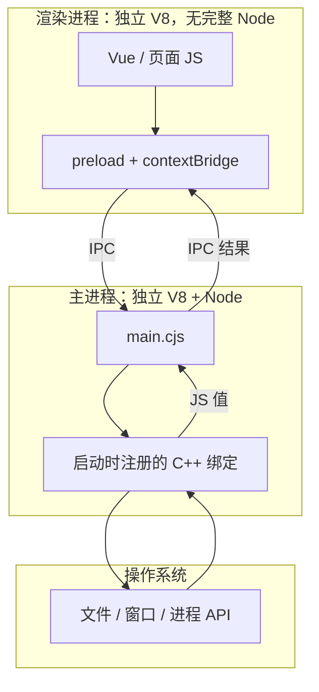

## 一句话结论

> **主进程里**：JavaScript 通过 V8 调用「启动时已注册的 C++ 函数」，间接使用操作系统能力。  
> **渲染进程里（Vue）**：默认**不是**同一个 V8、也**不是**完整 Node；要碰系统得通过 **IPC** 找主进程。

下面按「先分清两套运行时 → 再理解主进程怎么过桥 → 最后看 Vue 怎么间接用能力」的顺序讲。

---

## 一、最容易混的一点：不是同一个 Node，也不是同一个 V8

很多人以为 `main.cjs` 和 Vue 打包后的 JS「都在 Electron 里跑，应该是同一个引擎」。**其实不是。**

### 1.1 两套 JS，跑在两个进程里

```text
┌──────────── 主进程 ────────────┐     ┌────────── 渲染进程 ──────────┐
│  electron/main.cjs             │     │  Vue 打包后的 JS（dist）        │
│  Node 运行时 ✅                 │     │  Node 运行时 ❌（通常已关闭）   │
│  require('electron') ✅        │     │  更像 Chrome 里跑网页           │
│  require('fs') ✅              │     │  只有 Web API + 可选 preload   │
│  自己的 V8 isolate             │     │  自己的 V8 isolate             │
└────────────────────────────────┘     └────────────────────────────────┘
              │                                        │
              └──────────── IPC（跨进程消息）─────────────┘
```

| 代码 | 跑在哪 | 环境 |
|------|--------|------|
| **`main.cjs`** | 主进程 | 完整 **Node + Electron** |
| **Vue 业务代码** | `BrowserWindow` 里的渲染进程 | **Chromium**（接近浏览器） |

配置了 `nodeIntegration: false` 时，Vue 里**不能**像 `main.cjs` 那样随便 `require('fs')`。

### 1.2 两个 V8 一样吗？——不一样

| | 主进程 | 渲染进程（Vue） |
|---|--------|----------------|
| 进程 | 1 个 Electron 主进程 | 每个窗口至少 1 个 Chromium 渲染进程 |
| V8 | 给 **Node** 用的那份 | 给 **网页** 用的那份（在 Chromium 里） |
| 是否同一个堆/上下文 | ❌ 隔离的 **两个（或多个）V8 isolate** | ❌ |

类比：

- 主进程 V8 ≈ 后台服务里的 JS 引擎  
- 渲染进程 V8 ≈ Chrome 打开一个标签页里的 JS 引擎  

**不是「一个 V8 跑两份代码」**，而是 **两个进程各有一个 V8**。  
`main.cjs` 的 JS 和 Vue 的 JS **不会**跟同一个 V8 实例交互。

### 1.3 两个 Node 一样吗？——也不一样

更准确地说：**只有主进程那份算「在 Node 里」。**

- **主进程**：Electron 内置 Node，跑 `main.cjs`。  
- **渲染进程**（现代默认配置）：**没有**把完整 Node 暴露给 Vue；页面 JS 由 **Chromium** 执行，环境接近浏览器。

> Vue 里的 JS **不是**和 `main.cjs` 共用同一个 Node 进程里的 Node API。

### 1.4 为什么都是 JavaScript，却感觉像「都在 Electron 里」？

因为 **Electron 这个桌面应用** 同时带了：

- 一套 **Node 主进程**（管窗口、文件、子进程）  
- 一套 **Chromium**（显示 Vue 页面）  

对外是一个 App，对内是 **多进程**：

```text
electron 可执行文件
├── 主进程：Node + V8 + main.cjs
└── 渲染进程：Chromium + V8 + Vue（无完整 Node）
```

`window.loadURL(...)` 的作用：主进程让 Chromium **另起一个渲染进程** 去加载你的页面。

### 1.5 三个问题，一张表

| 问题 | 答案 |
|------|------|
| `main.cjs` 和 Vue 会跟**同一个 V8** 交互吗？ | **不会**，各进程各有一个 V8 |
| Vue 的 JS 也在 **Node** 里跑吗？ | **默认不会**，在 Chromium 渲染进程里跑 |
| 两个 Node 一样吗？ | **不一样**；实质是主进程有 Node，Vue 侧没有完整 Node |

后面说的「绑定好了，JS 一调就进 C++」——**对主进程的 `main.cjs` 成立**；**对 Vue 页面**，默认只有浏览器那套（DOM、`fetch` 等），要碰系统得 **IPC 找主进程**。

---

## 二、主进程里：JS 怎么碰到系统

### 2.1 调用链路（心智模型）

**不是「JS 被编译成 C++ 指令」**，而是一次跨语言函数调用：

```text
你写的 JS（require('fs').readFile、new BrowserWindow()）
        ↓
V8 执行，遇到「原生绑定」（Native Binding）
        ↓
跳进 Electron / Node 里用 C++ 写好的函数
        ↓
C++ 调操作系统 API
        ↓
结果包装成 JS 值，还给 V8 / 你的代码
```

```text
  ┌─────────────┐     原生绑定层      ┌─────────────┐     系统 API     ┌──────────┐
  │  你的 JS    │ ─────────────────→ │  C++ 实现   │ ──────────────→ │  操作系统  │
  │  (V8 执行)  │ ←───────────────── │ (Node/Electron)│ ←────────────── │          │
  └─────────────┘   返回值转成 JS 值   └─────────────┘                   └──────────┘
```

| 层级 | 职责 |
|------|------|
| **V8** | 解析、执行 JavaScript |
| **C++ 绑定层** | 注册「JS 函数 ↔ C++ 函数」的桥（`fs`、`BrowserWindow`…） |
| **操作系统** | 真正的文件、窗口、进程、网络 |

记法：**运行时桥接**，不是 **编译期翻译**。

| 说法 | 对不对 |
|------|--------|
| 调 `readFile` 时跳到同进程里的 C++ 函数 | ✅ |
| 整份业务 JS 先编译成 C++ 机器码再跑 | ❌ |

### 2.2 事先注册好的「插座」

C++ 绑定像 **开机时已装好的插座**：

1. **Electron / Node 启动时**，C++ 向 V8 **注册**原生函数（`fs.readFile`、`BrowserWindow`、`app.whenReady`…）。  
2. JS 里它们看起来像普通对象、方法。  
3. **一调用**，V8 **直接跳进**已注册的 C++，不会把整段业务 JS「翻译成 C++」。  
4. C++ 完成后，把返回值变回 JS 类型。

> **绑定事先写好 → JS 一调 → 就等于执行那段 C++。**（**仅主进程**这条链路。）

| | 自写 `function foo() {}` | `fs.readFile` 等原生 API |
|--|--------------------------|---------------------------|
| 谁执行 | V8 跑 JS | V8 转调已注册 C++ |
| 能否碰系统 | 不能（除非再调别的 API） | 能 |
| 要不要注册 | 不需要 | **必须** |

**只有被注册过的 API 才能过桥**；自写函数不会自动变 C++。

### 2.3 主进程示例

```js
// main.cjs（主进程）
const { app, BrowserWindow } = require('electron')
const fs = require('fs')

app.whenReady().then(() => {
  const win = new BrowserWindow({ width: 800, height: 600 })
  // new BrowserWindow() → C++ 绑定 → 系统创建窗口
})
```

```text
main.cjs → 主进程 V8 → 命中 C++ 绑定 → 系统 API → 返回 JS 对象
```

全程在**主进程一个进程**内完成，对你来说就是「调了一个 JS 函数」。

---

## 三、渲染进程里：Vue 怎么间接用系统能力

渲染进程里跑的是 **Chromium + Vue**。`nodeIntegration: false` 时：

- 不能随意 `require('fs')`、不能 `new BrowserWindow()`  
- 页面 JS 由 **渲染进程自己的 V8** 执行，但**没有**主进程那排 Node/Electron「插座」

### 3.1 标准路径：IPC

不能指望「和 main 共用同一个 V8/Node」，而是：

```text
Vue（渲染进程 V8）
  → ipcRenderer.invoke('run-agent', ...)
  → 主进程 ipcMain（主进程 V8 + Node）
  → fs.readFile / child_process / BrowserWindow …
  → 结果经 IPC 回传 Vue
```

| 进程 | 能否直接走 C++ 绑定 | 典型方式 |
|------|---------------------|----------|
| 主进程 | ✅ | `require('electron')`、`fs` |
| 渲染进程 | ❌（默认） | `preload` + `contextBridge` + **IPC** |

**主进程**：同进程函数调用，直接插「插座」。  
**渲染进程**：发消息，请主进程代插「插座」。

### 3.2 preload：窄口子，不是第二套 Node

**preload** 仍在渲染进程，在页面加载前执行，用 `contextBridge` 向页面暴露**白名单** API（如 `window.api.readFile`）。

```text
Vue 调用 window.api.readFile(path)
  → preload 里封装的 ipcRenderer.invoke
  → 主进程 fs.readFile（C++ 绑定 → 系统）
```

preload **不会**在渲染进程再注册一套 C++ 绑定；只是把 IPC 包成好用的 JS 函数。

---

## 四、总览图



---

## 五、自检清单

**进程与运行时**

- [ ] 能说清主进程、渲染进程是**两个进程、两个 V8**  
- [ ] 知道 Vue 默认**不在**完整 Node 里跑  
- [ ] 知道 `main.cjs` 与 Vue **不共用**同一个 V8 堆  

**主进程与绑定**

- [ ] 能说清 V8、C++ 绑定、系统 API 各管什么  
- [ ] 知道绑定是**启动时注册**的「插座」，调用时跳进 C++  
- [ ] 知道自写 `function` 不会变 C++；只有已注册 API 能过桥  
- [ ] 不会把「JS 调系统」理解成「JS 编译成 C++」  

**渲染进程与 IPC**

- [ ] 知道渲染进程默认要靠 **IPC** 让主进程调系统 API  
- [ ] 知道 preload 是 IPC 的薄封装，不是第二套 Node  

---

## 六、小结

| 维度 | 主进程（`main.cjs`） | 渲染进程（Vue） |
|------|----------------------|-----------------|
| V8 | 主进程里、给 Node 用 | Chromium 里、给网页用 |
| Node | ✅ 完整 Node + Electron | ❌ 通常关闭 `nodeIntegration` |
| 调系统 | JS → 已注册 C++ → 系统 API | IPC → 主进程再调 C++ |
| 记忆 | 「插座」在主进程墙上 | 通过 IPC 请主进程插电 |

学 Electron 桌面端，建议顺序：

1. 先分清 **两套 V8 / 两套进程**（本章第一节）  
2. 再理解主进程 **注册 + 跳转**（第二节）  
3. 最后看 **IPC、preload、contextIsolation** 如何让 Vue 安全地用主进程能力（第三、四节）  

把这三层串起来，后面读项目里的 `main.cjs`、`preload.ts`、Vue 发 IPC 的代码会顺很多。
