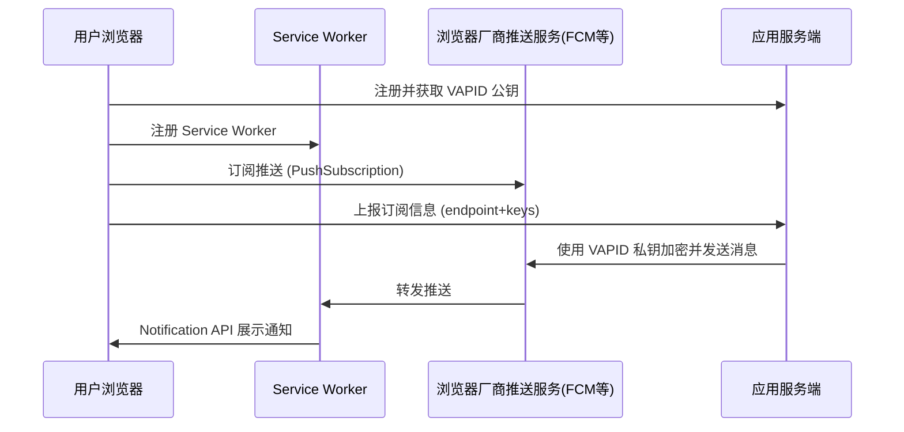

---

title: Web Push 推送简介
date: 2025-09-05
categories: \[Web 实时通讯, 浏览器推送]
tags: \[Web Push, Service Worker, PWA, VAPID, 离线通知, 实时消息]
description: 全面介绍 Web Push 技术的原理、特点、实现步骤和典型应用场景，帮助前端/全栈开发者理解并快速落地。

---

# 什么是 Web Push？

**Web Push** 是浏览器层面的 **推送通知机制**。与 WebSocket 或 SSE 不同，它不依赖页面是否处于前台，甚至用户没有打开网页也能收到通知。核心依赖：

- **Service Worker**：浏览器的后台脚本，常驻运行。
- **Push API**：浏览器与推送服务（FCM、APNs 等）之间的推送通道。
- **Notification API**：展示系统级通知。

特点：

- **跨平台**：Chrome、Firefox、Edge、Safari（部分版本）均支持。
- **后台可达**：即使网页未激活或浏览器最小化也能收到。
- **需用户授权**：必须 HTTPS，且用户点击“允许通知”。
- **带有身份机制**：通过 VAPID（Voluntary Application Server Identification for Web Push）实现应用级认证。

---

# 工作流程



---

# 核心实现步骤

## 1. 生成 VAPID 密钥对

```bash
npx web-push generate-vapid-keys
```

会得到 **公钥 / 私钥**，公钥发给前端，私钥保存在服务端。

---

## 2. 前端注册 Service Worker

```js
const reg = await navigator.serviceWorker.register("/sw.js");

// 申请通知权限
const permission = await Notification.requestPermission();
if (permission === "granted") {
  // 订阅推送
  const sub = await reg.pushManager.subscribe({
    userVisibleOnly: true,
    applicationServerKey: "<VAPID_PUBLIC_KEY_BASE64URL>",
  });
  // 上报给服务端保存
  await fetch("/push/subscribe", { method: "POST", body: JSON.stringify(sub) });
}
```

---

## 3. Service Worker 处理推送

```js
// sw.js
self.addEventListener("push", (event) => {
  const data = event.data?.json() ?? {};
  event.waitUntil(
    self.registration.showNotification(data.title || "通知", {
      body: data.body,
      icon: "/icon.png",
    })
  );
});
```

---

## 4. 服务端发送推送

以 Node.js 为例：

```js
import webpush from "web-push";

// 设置 VAPID
webpush.setVapidDetails(
  "mailto:admin@example.com",
  process.env.VAPID_PUBLIC,
  process.env.VAPID_PRIVATE
);

// subs 存储用户的 PushSubscription
export async function sendPush(sub, payload) {
  await webpush.sendNotification(sub, JSON.stringify(payload));
}
```

---

# 典型应用场景

- **消息提醒**：聊天应用收到新消息。
- **电商营销**：用户未登录页面也能收到促销信息。
- **系统告警**：后台监控推送紧急故障。
- **PWA（渐进式 Web 应用）**：接近原生 App 的体验。

---

# 优缺点对比

✅ 优点：

- 浏览器级支持，后台可达。
- 无需页面常驻，适合通知类消息。
- 跨浏览器标准（W3C Push API）。

⚠️ 缺点：

- 依赖用户同意，存在拒绝率。
- Safari 支持有限制（macOS 较晚才全面支持）。
- 消息大小有限制（通常 4KB）。
- 不适合大流量/高频推送（需 WebSocket/SSE）。

---

# 小结

**Web Push** = **Service Worker + Push API + Notification API**
适合“提醒/通知”类场景，不适合实时高频通信。生产实践里常和 **WebSocket/SSE** 组合：

- **WebSocket**：前台实时互动。
- **Web Push**：后台/离线通知兜底。

---

要不要我帮你写一个 **完整的最小 Web Push DEMO 项目（前端+后端）**，可以直接跑通并测试浏览器推送？
