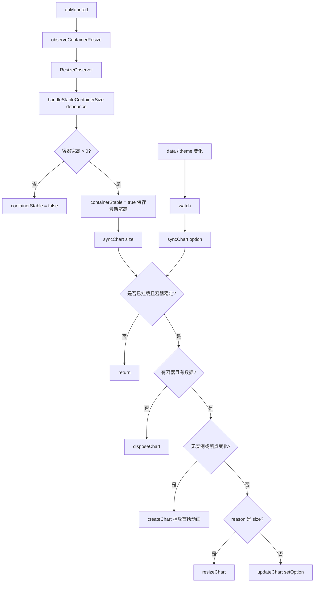

## 一、问题长什么样

在业务里很常见：一个 ECharts 图表同时受几类因素影响：

| 来源 | 典型触发 |
|------|----------|
| **数据** | 接口返回、`props` 更新 |
| **主题** | 明暗色切换、CSS 变量变化 |
| **容器** | 父级 `v-if`、Tab 切换、Flex 布局、窗口 resize |
| **断点布局** | 移动端 / 桌面端布局差异 |

如果每个因素都各自触发 `echarts.init()` 或 `setOption()`，很容易出现：

- 进入页面图表闪 2～3 次
- 控制台反复 `dispose` / `init`
- 图表只初始化一次后，首绘动画却被 `resize()` 截断
- 饼图 expansion 动画刚展开一点，就瞬间跳到最终状态
- 接手代码的人不知道到底应该从 `mounted`、`watch`、`resize` 还是 `renderChart` 看起

本质不是 Vue 或 ECharts 的 bug，而是：

> **数据变化、主题变化、容器尺寸变化混在一起处理，导致重路径和轻路径没有分清。**

---

## 二、先想清楚：四种变化，四种成本

图表更新不是只有一种方式。

| 变化类型 | 推荐处理 | 成本 |
|----------|----------|------|
| 数据变化 | `setOption()` | 中 |
| 主题变化 | `setOption()` | 中 |
| 容器尺寸变化 | `chart.resize()` | 低 |
| 移动端/桌面端布局变化 | `dispose + init + setOption()` | 高 |

核心原则：

> **能 `resize` 就不要 `setOption`；能 `setOption` 就不要 `dispose + init`。**

但还有一个隐藏问题：  
首绘动画期间如果发生 `resize()`，动画可能会被中途打断。

所以最终原则要再加一句：

> **首绘前先等容器尺寸稳定，首绘动画期间不要让 resize 插队。**

---

## 三、最终设计：三个入口，一个决策中心

以前容易写成这样：

```txt
onMounted     → scheduleRender
watch data    → scheduleRender
watch theme   → scheduleRender
ResizeObserver → handleResize / renderChart
window.resize → handleResize
```

入口太多，接手者很难判断谁才是主线。

现在改成：

```txt
onMounted：
  只安装 ResizeObserver

watch：
  只响应 data / theme 变化

ResizeObserver：
  等容器尺寸稳定后触发 syncChart

syncChart：
  唯一决定 create / update / resize / dispose
```

也就是：

```txt
尺寸来源：ResizeObserver
数据来源：watch
最终决策：syncChart
```

这样接手者只要从 `syncChart()` 看起，就能理解整个图表生命周期。

---

## 四、为什么 onMounted 不再主动渲染

很多图表问题来自这里：

```js
onMounted(() => {
  renderChart()
})
```

看起来合理，但在实际布局里，`onMounted` 只代表 DOM 节点存在，不代表容器尺寸已经稳定。

比如：

- 父级是 flex 布局
- 父级有过渡动画
- 外层 Tab 刚切换
- 容器高度由异步内容撑开
- 父组件刚从 `v-if` 变为显示

这时如果立即 `echarts.init()`，图表可能会在错误尺寸里开始首轮动画。
后续 `ResizeObserver` 又触发 `chart.resize()`，动画就容易被截断。

所以更好的做法是：

> **onMounted 只负责监听容器尺寸，不负责渲染图表。**

首次渲染交给 `ResizeObserver`：

```txt
mounted
  ↓
安装 ResizeObserver
  ↓
ResizeObserver 拿到容器尺寸
  ↓
debounce 等尺寸稳定
  ↓
syncChart('size')
  ↓
createChart()
```

---

## 五、尺寸稳定后再绘制

这里的关键不是 `nextTick`，也不是双 `requestAnimationFrame`，而是：

> **容器尺寸连续一小段时间没有变化，再允许图表初始化。**

最简单的实现是给 `ResizeObserver` 加 debounce：

```js
const CONTAINER_STABLE_DELAY = 80

const handleStableContainerSize = debounce((width, height) => {
  if (!isMounted) return

  if (width <= 0 || height <= 0) {
    containerStable = false
    return
  }

  containerStable = true
  latestContainerWidth = width
  latestContainerHeight = height

  syncChart('size')
}, CONTAINER_STABLE_DELAY)
```

它解决两个问题：

1. **避免 0 宽高时初始化图表**
2. **避免容器还在变化时播放首绘动画**

`ResizeObserver` 只负责把尺寸交给它：

```js
const observeContainerResize = () => {
  if (!container.value || typeof ResizeObserver === 'undefined') return

  resizeObserver = new ResizeObserver((entries) => {
    const entry = entries[0]
    if (!entry) return

    const { width, height } = entry.contentRect

    handleStableContainerSize(width, height)
  })

  resizeObserver.observe(container.value)
}
```

---

## 六、布局断点基于容器，不基于 window

以前常写：

```js
const isMobile = () => window.innerWidth < 768
```

但图表真正关心的是自己的容器，不是浏览器窗口。

比如页面右侧有侧边栏，或者图表在卡片里，窗口宽度不变，图表容器宽度也可能变化。

所以断点应该基于 `ResizeObserver` 得到的容器宽度：

```js
const BREAKPOINT = 768

const getLayoutMode = () => {
  return latestContainerWidth < BREAKPOINT ? 'mobile' : 'desktop'
}
```

这样可以彻底去掉：

```js
window.addEventListener('resize', ...)
```

因为窗口变化最终也会体现为容器尺寸变化，`ResizeObserver` 足够了。

---

## 七、唯一决策中心：syncChart

`syncChart` 是整套方案的核心。

它只做一件事：根据当前状态决定图表应该创建、更新、缩放还是销毁。

```js
const syncChart = (reason = 'option') => {
  if (!isMounted || !containerStable) return

  if (!container.value || !props.data?.length) {
    chartData = []
    disposeChart()
    return
  }

  chartData = formatData(props.data)

  const layoutMode = getLayoutMode()
  const layoutChanged = lastLayoutMode !== null && lastLayoutMode !== layoutMode
  const shouldRecreate = !chart || layoutChanged

  if (shouldRecreate) {
    createChart(layoutMode)
    return
  }

  if (reason === 'size') {
    resizeChart()
    return
  }

  updateChart(layoutMode)
}
```

这里有几个关键点。

### 1. 容器没稳定，不渲染

```js
if (!isMounted || !containerStable) return
```

如果 `watch` 比 `ResizeObserver` 更早触发，没关系，直接 return。
等容器稳定后，`ResizeObserver` 会再次调用 `syncChart('size')`。

### 2. 没数据就销毁

```js
if (!container.value || !props.data?.length) {
  chartData = []
  disposeChart()
  return
}
```

避免空数据时保留旧图。

### 3. 断点变化才重建

```js
const layoutChanged = lastLayoutMode !== null && lastLayoutMode !== layoutMode
const shouldRecreate = shouldCreate || layoutChanged
```

移动端和桌面端如果 `legend`、`radius`、`center` 差异很大，可以重建。
普通尺寸变化不需要重建，只需要 `resize()`。

### 4. 尺寸变化只 resize

```js
if (reason === 'size') {
  resizeChart()
  return
}
```

容器变大变小，本质只是画布像素变化，不需要重新 `setOption`。

---

## 八、data / theme 变化只走 watch

watch 不负责判断容器尺寸，也不负责初始化。

它只表达一件事：

> **配置相关内容变了，请同步图表。**

```js
watch(
  () => [props.data, themeStore.theme],
  () => {
    syncChart('option')
  },
  { deep: true },
)
```

如果此时容器已经稳定：

```txt
watch
  ↓
syncChart('option')
  ↓
updateChart()
```

如果此时容器还没稳定：

```txt
watch
  ↓
syncChart('option')
  ↓
return
  ↓
等待 ResizeObserver 稳定后 syncChart('size')
```

这就避免了多个 `immediate watch` 和 `onMounted render` 抢跑。

---

## 九、首绘动画为什么还需要保护

虽然我们已经等容器稳定后再 `init`，但仍然可能出现一种情况：

```txt
图表开始首轮 expansion 动画
  ↓
父级布局又轻微变化
  ↓
ResizeObserver 触发
  ↓
chart.resize()
  ↓
动画被打断
```

所以保留一个很轻量的状态：

```js
let chartPhase = 'idle'
let shouldResizeAfterIntro = false
let introTimer
```

含义很简单：

| 状态 | 含义 |
|------|------|
| `idle` | 没有图表 |
| `intro` | 首绘动画中 |
| `ready` | 图表稳定可 resize |

创建图表时进入 `intro`：

```js
const startIntro = () => {
  chartPhase = 'intro'
  shouldResizeAfterIntro = false

  clearTimeout(introTimer)

  // 首轮动画期间只记录 resize，避免 expansion 动画被中断
  introTimer = setTimeout(finishIntro, CHART_ANIMATION_MS + 80)
}
```

动画期间如果尺寸变化，不立即 resize，只记录一下：

```js
const resizeChart = () => {
  if (!chart) return

  if (chartPhase === 'intro') {
    shouldResizeAfterIntro = true
    return
  }

  chart.resize()
}
```

动画结束后，如果期间确实发生过尺寸变化，再补一次 resize：

```js
const finishIntro = () => {
  chartPhase = 'ready'

  clearTimeout(introTimer)
  introTimer = undefined

  if (shouldResizeAfterIntro && chart) {
    shouldResizeAfterIntro = false
    chart.resize()
  }
}
```

这比以前的 `resizeLocked` 更清楚：

```txt
以前：resize 被锁住了
现在：图表处于 intro 阶段，resize 延后到动画结束
```

语义更贴近图表生命周期。

---

## 十、完整心智模型



一句话：

> **ResizeObserver 管尺寸稳定，watch 管数据主题变化，syncChart 管最终决策。**

---

## 十一、最小骨架代码

下面是省略业务 option 后的骨架，适合以后复用：

```vue
<template>
  <div ref="container" class="w-full h-full"></div>
</template>

<script setup>
import { ref, watch, onMounted, onUnmounted } from 'vue'
import * as echarts from 'echarts'
import { debounce } from 'lodash-es'

const props = defineProps({
  data: {
    type: Array,
    default: () => [],
  },
})

const theme = ref('light')
const container = ref(null)

let chart = null
let resizeObserver = null
let chartData = []
let lastLayoutMode = null
let isMounted = false

let containerStable = false
let latestContainerWidth = 0
let latestContainerHeight = 0

let chartPhase = 'idle'
let shouldResizeAfterIntro = false
let introTimer

const BREAKPOINT = 768
const INTRO_ANIMATION_MS = 1000
const CONTAINER_STABLE_DELAY = 80

const getLayoutMode = () => {
  return latestContainerWidth < BREAKPOINT ? 'mobile' : 'desktop'
}

const formatData = (list = []) => {
  return list.map((item) => ({
    name: item.name,
    value: item.value,
  }))
}

const buildOption = (layoutMode, animate = true) => {
  const isMobile = layoutMode === 'mobile'

  return {
    series: [
      {
        type: 'pie',
        animationType: 'expansion',
        animationDuration: animate ? INTRO_ANIMATION_MS : 0,
        animationDurationUpdate: 0,
        radius: isMobile ? ['30%', '50%'] : ['60%', '90%'],
        center: isMobile ? ['30%', '50%'] : ['35%', '50%'],
        data: chartData,
      },
    ],
  }
}

const finishIntro = () => {
  chartPhase = 'ready'

  clearTimeout(introTimer)
  introTimer = undefined

  if (shouldResizeAfterIntro && chart) {
    shouldResizeAfterIntro = false
    chart.resize()
  }
}

const startIntro = () => {
  chartPhase = 'intro'
  shouldResizeAfterIntro = false

  clearTimeout(introTimer)

  // 首绘动画期间只记录 resize，避免动画被中断
  introTimer = setTimeout(finishIntro, INTRO_ANIMATION_MS + 80)
}

const disposeChart = () => {
  clearTimeout(introTimer)
  introTimer = undefined

  chart?.dispose()
  chart = null

  chartPhase = 'idle'
  shouldResizeAfterIntro = false
  lastLayoutMode = null
}

const createChart = (layoutMode) => {
  disposeChart()

  if (!container.value) return

  chart = echarts.init(container.value)
  lastLayoutMode = layoutMode

  startIntro()

  chart.setOption(buildOption(layoutMode, true), { notMerge: true })
}

const updateChart = (layoutMode) => {
  if (!chart) return

  lastLayoutMode = layoutMode

  chart.setOption(buildOption(layoutMode, false), { notMerge: true })
}

const resizeChart = () => {
  if (!chart) return

  if (chartPhase === 'intro') {
    shouldResizeAfterIntro = true
    return
  }

  chart.resize()
}

const syncChart = (reason = 'option') => {
  if (!isMounted || !containerStable) return

  if (!container.value || !props.data.length) {
    chartData = []
    disposeChart()
    return
  }

  chartData = formatData(props.data)

  const layoutMode = getLayoutMode()
  const layoutChanged = lastLayoutMode !== null && lastLayoutMode !== layoutMode
  const shouldRecreate = !chart || layoutChanged

  if (shouldRecreate) {
    createChart(layoutMode)
    return
  }

  if (reason === 'size') {
    resizeChart()
    return
  }

  updateChart(layoutMode)
}

// 容器尺寸稳定后再允许创建或 resize 图表
const handleStableContainerSize = debounce((width, height) => {
  if (!isMounted) return

  if (width <= 0 || height <= 0) {
    containerStable = false
    return
  }

  containerStable = true
  latestContainerWidth = width
  latestContainerHeight = height

  syncChart('size')
}, CONTAINER_STABLE_DELAY)

const observeContainerResize = () => {
  if (!container.value || typeof ResizeObserver === 'undefined') return

  resizeObserver = new ResizeObserver((entries) => {
    const entry = entries[0]
    if (!entry) return

    const { width, height } = entry.contentRect

    handleStableContainerSize(width, height)
  })

  resizeObserver.observe(container.value)
}

watch(
  () => [props.data, theme.value],
  () => {
    syncChart('option')
  },
  { deep: true },
)

onMounted(() => {
  isMounted = true

  observeContainerResize()
})

onUnmounted(() => {
  isMounted = false

  handleStableContainerSize.cancel()

  resizeObserver?.disconnect()
  resizeObserver = null

  containerStable = false
  latestContainerWidth = 0
  latestContainerHeight = 0

  chartData = []

  disposeChart()
})
</script>
```

---

## 十二、对照表：旧方案 vs 新方案

| 场景 | 旧方案 | 新方案 |
|------|--------|--------|
| 首次渲染 | `onMounted → scheduleRender` | `onMounted` 只监听，等 `ResizeObserver` 尺寸稳定后渲染 |
| data / theme 变化 | `watch → scheduleRender → nextTick` | `watch → syncChart('option')` |
| 容器变化 | `handleResize` 里判断 resize / render | `ResizeObserver → debounce → syncChart('size')` |
| 断点判断 | 常用 `window.innerWidth` | 使用容器宽度 `latestContainerWidth` |
| 普通尺寸变化 | `chart.resize()` | `syncChart('size') → resizeChart()` |
| 断点变化 | `renderChart(true)` | `syncChart` 内部判断 `layoutChanged` 后重建 |
| 首绘动画截断 | `resizeLocked` / `finished` / timeout | `chartPhase = intro`，动画期间只记录 resize，结束后补一次 |
| 代码入口 | `mounted/watch/resize` 多入口 | `syncChart` 单决策入口 |

---

## 十三、自检清单

上线前可以按这几条扫一遍：

- [ ] `onMounted` 只负责安装 `ResizeObserver`
- [ ] 没有 `window.addEventListener('resize')`
- [ ] 断点判断基于容器宽度，而不是 `window.innerWidth`
- [ ] `watch` 只监听 data / theme，并调用 `syncChart('option')`
- [ ] 首次渲染由 `ResizeObserver` 在容器尺寸稳定后触发
- [ ] `syncChart` 是唯一 create / update / resize / dispose 决策入口
- [ ] 普通尺寸变化只走 `chart.resize()`
- [ ] 断点变化才允许 `dispose + init`
- [ ] 首绘动画期间不立即 `resize`
- [ ] 数据 / 主题更新使用 `animationDurationUpdate: 0`，避免重复播放首绘动画
- [ ] `onUnmounted` 中清理 `ResizeObserver`、debounce、timer、chart 实例

---

## 十四、小结

这类 Vue + ECharts 问题，表面上是「图表重复渲染」或「动画被 resize 截断」，本质是生命周期没有收口。

最终方案可以概括成一句话：

> **mounted 只监听尺寸，watch 只监听配置，ResizeObserver 等尺寸稳定，syncChart 统一决策。**

再展开就是：

1. **容器优先**：不在 `onMounted` 里抢跑渲染，等 `ResizeObserver` 拿到稳定尺寸。
2. **入口收敛**：data / theme 走 watch，size 走 ResizeObserver，最终都进入 `syncChart`。
3. **成本分层**：普通尺寸变化只 `resize`，数据/主题变化才 `setOption`，断点变化才重建。
4. **动画保护**：首绘动画期间延后 resize，动画结束后补一次。
5. **容器断点**：用图表容器宽度判断 mobile / desktop，不依赖 `window.resize`。

这套结构比「多个 watch + mounted 主动渲染 + resize 锁」更容易维护。接手的人从 `syncChart()` 看起，就能快速理解整张图表的生命周期。
