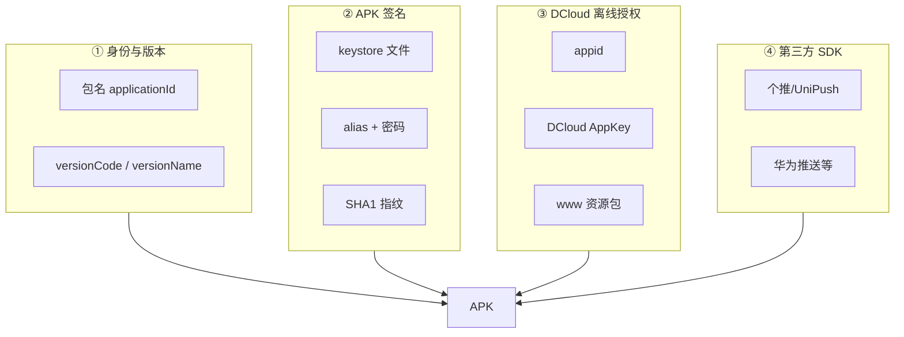

# Android uni-app 生产包需要什么？

本文是 [DCloud AppKey 是什么？](/posts/移动开发/uni-app/DCloud%20AppKey%20是什么？离线打包三要素必须一致) 的续篇。完整三平台流程见 [移动端打包签名与 DCloud 离线打包教程](/posts/移动开发/uni-app/移动端打包签名与%20DCloud%20离线打包教程)。

## 签名 SHA1 是什么？

Android 每个 APK 安装前都要用 **签名证书** 做数字签名，证明「这个包是谁发的、有没有被改过」。

**SHA1** 就是这张签名证书的 **指纹**（一串 40 位十六进制，例如 `AA:BB:CC:...`）：

- 同一张 keystore → SHA1 **永远一样**
- 换 keystore 或换 key → SHA1 **会变**
- 任何人解包 APK 都能读到，**不是秘密**

可以类比：

| 概念 | 类比 |
|------|------|
| keystore（`.keystore` / `.jks`） | 公章本体 |
| keyAlias | 章上的名字 |
| storePassword / keyPassword | 开保险柜、盖章的密码 |
| SHA1 | 公章在备案系统里的指纹编号 |

Google Play、微信开放平台、DCloud 后台登记时，常要求填 SHA1，就是为了确认「以后上架 / 调 SDK 的 APK，必须是这张证书签的」。

> **延伸阅读：** SHA1 指纹和安装验签用的「内容 hash」不是一回事；Android / iOS / 鸿蒙谁发证也不同，详见 [SHA1 是什么？Android、iOS 与鸿蒙签名发证有何不同](/posts/移动开发/uni-app/SHA1%20是什么？Android、iOS%20与鸿蒙签名发证有何不同)。

## Android 生产包需要什么？（按层次）

你们项目是 **uni 业务 + DCloud 原生壳 + 多个 SDK**，生产包大致分四层：



### ① 应用身份与版本（上架、更新用）

| 东西 | 你们项目在哪 | 作用 |
|------|-------------|------|
| **包名** `applicationId` | `build.gradle` → `com.future.hyqhjskh` | App 唯一 ID；换包名 = 另一个 App |
| **versionCode** | `build.gradle` → `155` | 整数，系统 / App Store 比「谁更新」 |
| **versionName** | `build.gradle` → `"1.5.5"` | 给用户看的版本号 |
| **App 名称、图标** | `prepare-build` 从品牌资源同步 | 桌面显示名、启动图标 |

### ② APK 签名（Google / 各平台认「是不是你发的」）

| 东西 | 你们项目在哪 | 作用 |
|------|-------------|------|
| **keystore 文件** | `.secrets/android/keystore/*.keystore` | 签名私钥容器 |
| **RELEASE_KEY_ALIAS** | `secrets.properties` | keystore 里用哪把 key |
| **RELEASE_STORE_PASSWORD** | `secrets.properties` | 打开 keystore |
| **RELEASE_KEY_PASSWORD** | `secrets.properties` | 使用 key 签名 |
| **SHA1 / SHA256** | 从 keystore 或 APK **算出来**，填到各后台 | 指纹，不写在工程里 |

Gradle 里用法：

```gradle
signingConfigs {
    config {
        keyAlias releaseKeyAlias
        keyPassword releaseKeyPassword
        storeFile file(releaseStoreFileName)
        storePassword releaseStorePassword
        v1SigningEnabled true
        v2SigningEnabled true
    }
}
```

Release 构建会强制用这套签名；**丢 keystore ≈ 无法以同一 App 身份更新**（只能换包名重新上架）。

**查 SHA1 示例**（把路径换成你们的 keystore）：

```bash
keytool -list -v -keystore .secrets/android/keystore/xxx.keystore -alias __UNI__3EAF30F
```

或对已打好的 APK：

```bash
# 解压 APK，对 META-INF/CERT.RSA
keytool -printcert -file CERT.RSA
```

### ③ DCloud 离线打包（uni 能不能跑）

| 东西 | 在哪 | 作用 |
|------|------|------|
| **appid** | `dcloud_control.xml` → `__UNI__3EAF30F` | 加载哪个 uni 应用 |
| **DCloud AppKey** | `AndroidManifest` + `secrets.properties` | DCloud 离线授权凭证 |
| **登记时的 SHA1** | dev.dcloud.net.cn 后台 | 和 AppKey **绑定**；APK 实际签名 SHA1 必须一致 |
| **www 资源** | `assets/apps/__UNI__3EAF30F/www/` | 编译好的 uni 页面 / 逻辑 |

DCloud 校验的是 **四条一起**：

```text
appid + 包名 + APK 签名 SHA1 + AppKey
         ↓
   必须和后台申请 AppKey 时填的一致
```

所以：**AppKey 管 DCloud 认不认你；SHA1 管「是不是当初登记那张证书签的包」**——两件事相关但不相同。

### ④ 第三方 SDK（推送、登录等，按品牌可选）

来自 `secrets.properties`，`prepare-build` 按品牌写入：

| 键名 | 作用 |
|------|------|
| `GETUI_APPID` / `GY_APP_ID` | 个推 / 一键登录 |
| `UNIPUSH_APPKEY` / `UNIPUSH_APPSECRET` | UniPush 2.0 |
| `GT_INSTALL_CHANNEL` | 个推安装渠道统计 |
| `HUAWEI_APP_ID` | 华为厂商推送（hyqh 等品牌） |
| `agconnect-services.json` | 华为 AGC 配置（slzq / hyqh 等） |

这些 **不参与 DCloud AppKey 校验**，但生产包若要用推送 / 一键登录，缺了会功能异常。

## 生产包完整流程（和你们仓库对应）

```text
1. prepare-build --apply          → 品牌、包名、AppKey、图标、SDK 配置
2. HBuilderX 发行 → 生成 www      → uni 业务编译产物
3. sync-uni-www-to-simpleDemo.sh  → www 拷进 assets
4. ./gradlew :simpleDemo:assembleRelease
   ├── 读 secrets.properties（keystore、AppKey、推送 key）
   ├── Gradle 检查：Release 时 AppKey、keystore 密码非空
   ├── 用 keystore 签名 → 产出 hyqh-jskh-prod.apk
   └── APK 自带一个 SHA1
5. （可选）渠道包 VasDolly / channel.txt
6. 上传应用商店 / 内部分发
```

## 几样东西容易混，对照一下

| | 谁发的 | 防什么 | 存在哪 |
|---|--------|--------|--------|
| **keystore + 密码** | 你们自己 | APK 被篡改、冒名更新 | `.secrets/android/keystore/` |
| **SHA1** | 从 keystore **算出来** | 各平台核对「是不是这张证签的」 | 填 DCloud / 微信 / Google 等后台 |
| **DCloud AppKey** | DCloud 后台生成 | 未授权跑 uni 离线包 | `secrets.properties` + Manifest |
| **个推 / 华为等 Key** | 各 SDK 厂商 | 推送、登录等能力 | `secrets.properties` |

## 一句话记

- **SHA1** = 签名证书的指纹，证明「这个 APK 是哪张证签的」
- **keystore** = 签名用的私钥文件，生产包必备
- **AppKey** = DCloud 发的 uni 离线许可证，且和 **登记时的 SHA1** 绑在一起
- **www** = uni 业务本身
- **推送等 Key** = 原生能力插件的配置

生产包最少要保证：**keystore 能签、SHA1 和 DCloud 后台一致、AppKey 对、www 是最新的**。

---

**延伸阅读：**

- [移动端打包签名与 DCloud 离线打包教程（系列总览）](/posts/移动开发/uni-app/移动端打包签名与%20DCloud%20离线打包教程)
- [Android keystore 密码与 APK 签名：打包时发生什么、安装时验什么](/posts/移动开发/uni-app/Android%20keystore%20密码与%20APK%20签名：打包时发生什么、安装时验什么) — keystore 两个密码、空密码风险、验签双 hash 对比
- [SHA1 是什么？Android、iOS 与鸿蒙签名发证有何不同](/posts/移动开发/uni-app/SHA1%20是什么？Android、iOS%20与鸿蒙签名发证有何不同) — 证书指纹 vs 内容 hash、三平台发证对比

下一步可写一份「**从 keystore 查 SHA1 → 和 DCloud 后台逐项对照**」的检查清单，照着打勾即可。
