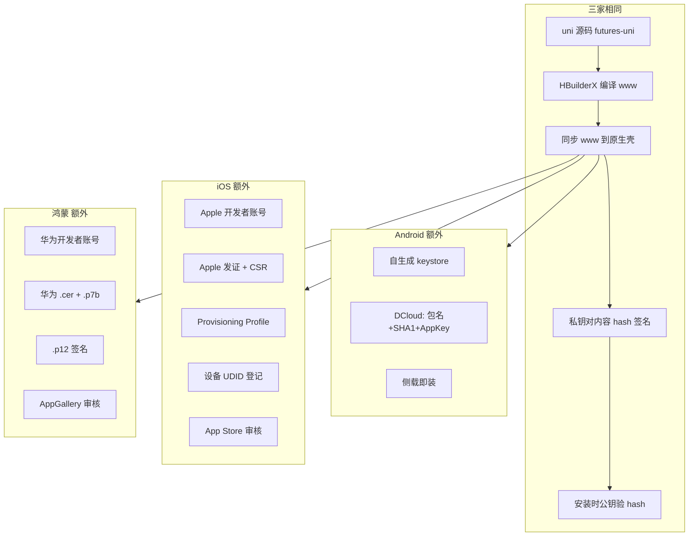

# 移动端打包签名与 DCloud 离线打包教程

> 基于 `futures-uniapp-client` 项目（uni-app + Android / iOS / 鸿蒙原生壳）整理。

本教程是 uni-app 离线打包 **系列总览**。分主题深入阅读：

- [DCloud AppKey 是什么？](/posts/移动开发/uni-app/DCloud%20AppKey%20是什么？离线打包三要素必须一致)
- [Android uni-app 生产包需要什么？](/posts/移动开发/uni-app/Android%20uni-app%20生产包需要什么？签名%20SHA1、keystore%20与构建流程)
- [Android keystore 密码与 APK 验签](/posts/移动开发/uni-app/Android%20keystore%20密码与%20APK%20签名：打包时发生什么、安装时验什么)
- [SHA1 与三平台发证差异](/posts/移动开发/uni-app/SHA1%20是什么？Android、iOS%20与鸿蒙签名发证有何不同)
- [uni-app Vue 在鸿蒙上如何运行？](/posts/移动开发/uni-app/uni-app%20Vue%20在鸿蒙上如何运行？编译、运行时与原生能力)

---

## 一、先搞懂 5 个通用概念

后面 Android / iOS / 鸿蒙都用同一套数学原理，差别在 **谁发证、多了哪些门禁**。

### 1. 密钥对

| | 作用 | 保密吗 |
|---|------|--------|
| **私钥** | 打包时签名 | 必须保密 |
| **公钥** | 安装时验签 | 公开，放在证书里 |

### 2. 数字签名（打包时）

```text
① 对 App 内容算 hash（摘要）
② 用私钥对 hash 签名 → 得到「签名块」
③ 签名块 + 证书（公钥）一起塞进安装包
```

### 3. 验签（安装时）

```text
① 重算 App 内容 → 得到 hash A
② 用证书公钥解签名块 → 还原 hash B
③ A == B → 通过；不等 → 被改过或伪造
```

**比的是两个 hash，不是公钥和签名块直接比。**

### 4. 证书

- 公钥 + 身份信息的「备案卡」
- Android 正式包多为 **自签名**（自己给自己发证）
- iOS / 鸿蒙由 **平台 CA 签发**

### 5. SHA1 指纹

- 对 **证书本身** 做 SHA1 运算得到的短编号
- 用途：在 DCloud、微信等 **后台登记**「我认哪张证」
- **不是** APK 内容的 hash，也 **不是** 验签时用的那个 hash

---

## 二、你们项目的整体架构

```text
futures-uni/          ← uni 业务源码（Vue）
       ↓ HBuilderX 编译
unpackage/.../www/    ← 编译产物（不提交 Git）
       ↓ rsync 脚本
futures-android/      ← Android 原生壳 + www
futures-ios/          ← iOS 原生壳 + www
       ↓ 各平台打包工具
APK / IPA / HAP
```

**两类配置要分开记：**

| 类型 | 谁管 | 提交 Git 吗 |
|------|------|------------|
| 品牌配置、AppKey、图标 | `prepare-build --apply` | 部分提交 |
| 编译后的 `www` | HBuilderX 本地生成 | 不提交 |

---

## 三、Android 完整流程（基准）

Android 最开放：**自己发证、自己签名、侧载即装**。

### 3.1 登记 / 准备（一次性 + 切品牌时）

```text
1. keytool 生成 keystore
   → 私钥 + 自签名证书（可设 store/key 密码，建议设）

2. 查证书 SHA1
   keytool -list -v -keystore xxx.keystore

3. DCloud 后台（dev.dcloud.net.cn）
   → appid __UNI__3EAF30F + 包名 + SHA1 → 生成 AppKey

4. 写入项目
   .secrets/android/secrets.{brand}.properties
   prepare-build --apply → 同步到 secrets.properties + AndroidManifest
```

**AppKey 是什么：** DCloud 发的离线授权码，不是密钥对。  
**校验四要素：** appid + 包名 + APK 签名 SHA1 + AppKey（全要和后台登记一致）。

### 3.2 日常打包

```text
① prepare-build --apply（品牌 / 环境 / 渠道）
② HBuilderX → 发行 → 生成本地打包 App 资源 → www/
③ sync-uni-www-to-simpleDemo.sh → 拷进 assets/apps/__UNI__3EAF30F/www/
④ ./gradlew :simpleDemo:assembleDebug 或 assembleRelease
```

### 3.3 APK 里有什么

```text
APK
├── 代码、资源、www、assets/data/dcloud_control.xml（appid）
├── AndroidManifest meta-data dcloud_appkey
├── 签名块（私钥对内容 hash 签出来的）
└── 证书（公钥）
```

### 3.4 安装时系统检查

```text
① 公钥验签：内容 hash 是否被改
② 若是更新：证书必须和已装 App 相同
（不查 Profile、不查设备白名单、不 care 证书谁发的）
```

### 3.5 Debug vs Release

| | Debug | Release |
|---|-------|---------|
| 签名 | 默认 debug.keystore；你们项目有密码时用 Release 证 | 必须 Release keystore |
| AppKey | 运行时仍要，且 SHA1 要和后台一致 | 同左 |
| Gradle 检查 AppKey/密码非空 | 你们自己写的，仅 Release 拦截 | 会检查 |

### 3.6 项目文件对照

| 用途 | 路径 |
|------|------|
| keystore | `.secrets/android/keystore/*.keystore` |
| 密码、AppKey、推送 Key | `.secrets/android/secrets.{brand}.properties` |
| Gradle 读取 | `futures-android/secrets.properties` |
| appid | `assets/data/dcloud_control.xml` |
| AppKey | `AndroidManifest.xml` → `dcloud_appkey` |

---

## 四、iOS 完整流程（在 Android 基础上多了平台门禁）

验签原理相同，**多了 Apple 发证 + 描述文件 + 设备白名单**。

### 4.1 登记阶段（developer.apple.com）

```text
1. 加入 Apple Developer Program

2. Mac 钥匙串生成 CSR
   → 本地产生密钥对，私钥留钥匙串
   → CSR = 请 Apple 给我的公钥发证

3. 后台创建 App ID（Bundle ID，如 com.future.hyqhjskh）

4. 上传 CSR → Apple 签发 Development / Distribution 证书

5. 登记测试设备 UDID（真机 Debug 必须）

6. 创建 Provisioning Profile（.mobileprovision）
   绑定：App ID + 证书 + 设备列表（或 App Store 渠道）+ Entitlements + 有效期

7. DCloud 后台：Bundle ID + iOS AppKey（与 Android 那串不同）
```

**Provisioning Profile = 准装证**（Android 没有）。  
Bundle ID 不对、Profile 过期、设备 UDID 不在列表里 → 装不上。

### 4.2 打包阶段

```text
① prepare-build → Bundle ID、dcloud_appkey 写入 Info.plist
② HBuilderX 编译 www → 同步到 Pandora/apps/__UNI__3EAF30F/www/
③ Xcode 构建：
   - 钥匙串取私钥
   - Apple 证书签名
   - 按 Entitlements 签 .app
   - 嵌入 embedded.mobileprovision
   → 产出 .ipa
```

**Automatic Signing：** Xcode 自动跟后台同步证书和 Profile，本质仍是上面这套。

### 4.3 .app / .ipa 里有什么

```text
.app/
├── 可执行文件、资源、www…
├── _CodeSignature/CodeResources   ← 各文件 hash 清单 + CMS 签名块
└── embedded.mobileprovision       ← 准装证（不是签名块）
```

### 4.4 安装时系统检查（两类）

**A. 准装证（Android 没有）**

- Profile 过期？
- Bundle ID 一致？
- Debug：设备 UDID 在列表里？
- 证书是 Apple 信任链？

**B. 验签（同 Android 原理）**

- 重算各文件 hash vs 公钥从 CMS 签名块还原的 hash

### 4.5 上架

```text
上传 App Store Connect → Apple 审核 → 商店分发（可能再签一层）
```

### 4.6 真机 Debug 条件

后台配证书 / 设备 / Profile **是真机调试的前置条件，不是障碍**。  
不能 Debug 的情况：缺 Development 证、设备未登记 UDID、Profile 过期、只有 Distribution 配置。

### 4.7 项目文件对照

| 用途 | 路径 |
|------|------|
| AppKey | `HBuilder-Hello-Info.plist` → `dcloud_appkey` |
| 签名 | Apple 账号 + Mac 钥匙串 + Xcode |
| 个人 Debug 回退 | `futures-ios/secrets.debug.properties` |
| 一键脚本 | `futures-ios/scripts/prepare-hyqh-ios-install.sh` |

---

## 五、鸿蒙完整流程（结构同 iOS，发证方是华为）

### 5.1 登记阶段（AppGallery Connect / 华为开发者）

```text
1. 注册华为开发者账号

2. 创建应用，登记包名（如 com.future.hyqhjskh.hm）

3. 本地 CSR → 平台申请证书 → 华为签发 .cer（调试 / 发布各一套）

4. 申请 Profile（.p7b）
   绑定：包名 + 证书 + 权限 + 有效期

5. 导出 .p12（私钥 + 证书 + 密码）

6. prepare-build --apply → 路径写入 manifest.json signingConfigs
```

### 5.2 打包阶段

```text
① HBuilderX 编译鸿蒙包 / 离线资源
② 用 .p12 私钥 + .cer + .p7b 签名 → .hap / .app
```

### 5.3 安装时检查

```text
① Profile 有效、未过期
② 证书华为信任链
③ 包名与 Profile 一致
④ hash 验签（同 Android）
⑤ 指定设备 Profile：设备在白名单内
```

### 5.4 项目文件对照（华源示例）

```text
.secrets/harmonyos/huayuan/
├── 华源期货-极速开户-调试.cer
├── 华源期货-极速开户-调试Debug.p7b
├── 华源期货-极速开户-发布.cer
├── 华源期货-极速开户-发布Release.p7b
└── futures-hy.p12
```

可选口令：`.secrets/harmonyos/<品牌>/signing.local.json`（不提交）。

---

## 六、三平台一图对照

### 6.1 从登记到安装的统一流程



### 6.2 核心差异表

| 维度 | Android | iOS | 鸿蒙 |
|------|---------|-----|------|
| 谁发证 | 自己（自签名） | Apple | 华为 |
| 私钥存放 | `.keystore` | Mac 钥匙串 | `.p12` |
| 准装证 Profile | 无 | `.mobileprovision` | `.p7b` |
| 设备白名单 | 无 | Debug 要 UDID | 指定设备发布要 |
| 侧载 | 可以 | 受限 | 受限 |
| DCloud AppKey | 要（+ SHA1） | 要（单独一串） | manifest 签名配置 |
| 验签原理 | hash 对比 | hash 对比 | hash 对比 |

### 6.3 安装包内有什么

| 内容 | Android | iOS | 鸿蒙 |
|------|---------|-----|------|
| 签名块 | ✅ | ✅ `_CodeSignature` | ✅ |
| 证书（公钥） | ✅ | ✅ | ✅ |
| Profile 准装证 | ❌ | ✅ `embedded.mobileprovision` | ✅ `.p7b` 信息 |
| DCloud appid | `dcloud_control.xml` | Pandora + control | manifest |
| DCloud AppKey | Manifest meta-data | Info.plist | — |

---

## 七、DCloud 离线打包（三平台都要记）

与原生签名 **并行、独立** 的一层：

```text
登记：dev.dcloud.net.cn
  appid __UNI__3EAF30F
  + 平台包名/Bundle ID
  + Android 还要 APK 证书 SHA1
  → 生成 AppKey

运行时 SDK 校验 → 通过才加载 www/
```

| 概念 | 说明 |
|------|------|
| appid | 公开，在 `dcloud_control.xml` |
| AppKey | 后台发的授权码，不是密钥对 |
| Android SHA1 | 证书指纹，绑定签名证 |
| 与 APK 验签关系 | 各验各的，互不替代 |

---

## 八、你们项目实操清单

### 8.1 切品牌 / 发包前

```bash
cd futures-uni
npm run deploy:prepare
# 或 prepare-build:apply --brand hyqh --env test --platform all --apply
```

### 8.2 Android Debug

```bash
# 1 prepare-build 已跑
# 2 HBuilderX 生成 www
futures-android/scripts/sync-uni-www-to-simpleDemo.sh
cd futures-android && ./gradlew :simpleDemo:assembleDebug
```

### 8.3 Android Release

同上，最后 `assembleRelease`；确认 keystore 密码、AppKey、SHA1 与 DCloud 后台一致。

### 8.4 iOS 真机

```bash
# www 同步 + Xcode 构建
futures-ios/scripts/prepare-hyqh-ios-install.sh
```

确认：Apple 账号正常、设备 UDID 已登记、Profile 有效、Info.plist AppKey 与 Bundle ID 匹配。

### 8.5 鸿蒙

```bash
prepare-build --apply  # 写入 manifest signingConfigs
# HBuilderX 鸿蒙发行，.cer/.p7b/.p12 已在 .secrets/harmonyos/
```

### 8.6 版本号同步（发版时）

四处保持一致：

- `futures-android/simpleDemo/build.gradle`
- `futures-ios/.../project.pbxproj`
- `futures-uni/config/index.js`
- `futures-uni/manifest.json`

---

## 九、常见问题速查

| 现象 | 可能原因 |
|------|----------|
| Android 白屏 / 未授权 | AppKey、包名、SHA1、appid 不一致 |
| Android Release 构建失败 | `secrets.properties` 缺 AppKey 或 keystore 密码（Gradle 自检） |
| iOS AppKey 配置错误 | Bundle ID / 签名 SHA1 / Info.plist AppKey 与 DCloud 后台不符 |
| iOS 装不上 | Profile 过期、设备 UDID 未登记、证书问题 |
| Debug 改了 uni 不生效 | 未重新编译 www 或未 sync 到原生壳 |
| keystore 不设密码的风险 | 文件泄露即可冒名签名，与 DCloud 无关 |

---

## 十、一句话总结

**三家都是：私钥签内容 hash，公钥验 hash。**  
**Android 自己发证，侧载即装，DCloud 再验 AppKey + SHA1。**  
**iOS / 鸿蒙多了平台发证、Profile 准装证、设备 / 商店门禁。**  
**你们项目 = uni 编译 www + prepare-build 配品牌 + 原生壳打包签名。**

---

**分主题深入**

- [DCloud AppKey 是什么？](/posts/移动开发/uni-app/DCloud%20AppKey%20是什么？离线打包三要素必须一致)
- [Android uni-app 生产包需要什么？](/posts/移动开发/uni-app/Android%20uni-app%20生产包需要什么？签名%20SHA1、keystore%20与构建流程)
- [Android keystore 密码与 APK 验签](/posts/移动开发/uni-app/Android%20keystore%20密码与%20APK%20签名：打包时发生什么、安装时验什么)
- [SHA1 与三平台发证差异](/posts/移动开发/uni-app/SHA1%20是什么？Android、iOS%20与鸿蒙签名发证有何不同)
- [uni-app Vue 在鸿蒙上如何运行？](/posts/移动开发/uni-app/uni-app%20Vue%20在鸿蒙上如何运行？编译、运行时与原生能力)
