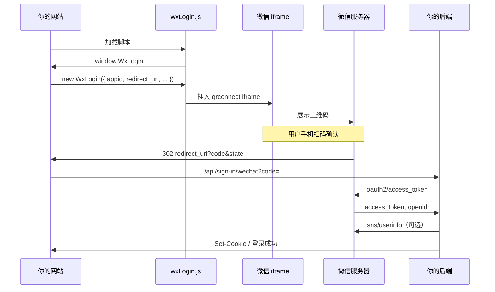

网站应用里的微信扫码登录二维码，**不是我们自己画出来的**，而是 **微信开放平台前端登录组件** 生成的。搞清这条链路，后面排查「二维码出不来」「iframe 里 Oops」会快很多。

---

## 整体流程（四步）

```text
1. 页面加载 wxLogin.js → 挂载 window.WxLogin
2. new WxLogin({ ... }) → 在指定 DOM 里插入 iframe
3. iframe 加载 open.weixin.qq.com/.../qrconnect → 微信渲染二维码
4. 用户扫码确认 → 跳 redirect_uri 带 code → 后端换 token / 写登录态
```

---

## 1. 页面加载微信脚本

在登录页（例如 Next.js `app/.../sign-in/page.tsx`）引入官方脚本：

```tsx
<Script
  src="https://res.wx.qq.com/connect/zh_CN/htmledition/js/wxLogin.js"
  strategy="afterInteractive"
  onLoad={() => setWechatReady(true)}
/>
```

`wxLogin.js` 会在浏览器里挂一个全局对象：

```ts
window.WxLogin
```

脚本没加载成功时，后面 `new WxLogin` 不会执行，页面上也就不会出现二维码容器里的内容。

---

## 2. 调用 `new WxLogin(...)`

脚本加载完成后，在**已挂载的 DOM 容器**上初始化：

```ts
new window.WxLogin({
  self_redirect: false,
  id: "wechat-login",
  appid: wechatAppId,
  scope: "snsapi_login",
  redirect_uri: redirectUri,
  state: "your-login-state",
  style: "black",
  href: "",
  stylelite: 0,
  fast_login: true,
})
```

常见参数含义：

| 参数 | 作用 |
|------|------|
| `id` | 二维码挂载的 DOM 容器，例如 `<div id="wechat-login" />` |
| `appid` | 微信开放平台 **网站应用** 的 AppID |
| `scope` | 网站扫码登录固定为 `snsapi_login` |
| `redirect_uri` | 用户扫码确认后，微信要跳回你站的地址（需与开放平台配置一致、URL 编码） |
| `state` | 防 CSRF / 标记登录来源，回调时会原样带回 |

页面上需要预留空容器：

```html
<div id="wechat-login"></div>
```

---

## 3. 微信组件插入 iframe（二维码在这）

`WxLogin` **不会**直接返回一张二维码图片 URL。它会在 `#wechat-login` 里 **插入一个 iframe**，地址大致指向：

```txt
https://open.weixin.qq.com/connect/qrconnect
  ?appid=...
  &redirect_uri=...
  &response_type=code
  &scope=snsapi_login
  &state=...
```

**二维码在 iframe 内部由微信自己渲染**。我们在 DevTools 里看到的往往是「一个 iframe」，而不是 `` 标签。

若 `appid`、`redirect_uri`、授权域名等校验不通过，iframe 里可能直接显示 **Oops** 等错误页，而不是二维码。

---

## 4. 扫码后：微信回调 + 后端换票

用户扫码并确认后，浏览器会跳到你传入的 `redirect_uri`，并追加查询参数，例如：

```txt
/api/sign-in/wechat?code=xxx&state=your-login-state
```

（实际 URL 还可能带业务自定义参数，如 `customState=...`。）

后端 Next API Route（或其它框架的路由）用 `code` 请求微信：

**第一步：换 access_token**

```txt
GET https://api.weixin.qq.com/sns/oauth2/access_token
```

常用 query：

- `appid`
- `secret`（`WECHAT_APP_SECRET`，**只放服务端**）
- `code`
- `grant_type=authorization_code`

得到 `access_token`、`openid`（及可能的 `unionid` 等）。

**第二步：拉用户信息（可选）**

```txt
GET https://api.weixin.qq.com/sns/userinfo
```

用 `access_token` + `openid` 取昵称、头像等，再写入数据库、发 session / cookie，完成登录。

```text
用户扫码
  → 微信跳 redirect_uri?code=...
  → 服务端用 code + secret 换 access_token
  → 再拉 userinfo（如需）
  → 建用户 / 更新资料 → 设置登录 cookie
```

---

## 心智模型图



---

## 二维码出不来：通常卡在哪

| 阶段 | 现象 | 常见原因 |
|------|------|----------|
| 1 | 容器一直是空的 | `wxLogin.js` 未加载（网络、CSP、脚本被拦） |
| 2 | 无 iframe | `wechatReady` 为 false 时没执行 `new WxLogin`；`id` 与 DOM 不一致 |
| 3 | iframe 有，里面是 Oops | `appid` 错、非网站应用、`redirect_uri` 未编码或与开放平台不一致、**授权域名**未配置 |
| 4 | 能扫码，回调 4xx/5xx | 后端 `secret`、code 过期、redirect 路由未实现 |

排查顺序建议：**Network 里 wxLogin.js 是否 200 → Elements 里是否有 iframe → iframe 内是否 Oops → 开放平台授权回调域与 redirect_uri**。

---

## 实践注意：localhost 与「别拦 WxLogin」

有的项目会在「本地域名」时**不加载**二维码、只显示文字提示。若你确认 **localhost 在微信开放平台已配好授权回调页**，技术上应 **允许 `WxLogin` 正常初始化**，把错误信息放在旁边做诊断，而不是在代码里直接拦截 `new WxLogin`。

否则会出现：本机其实能配通，却被前端逻辑提前挡住，误以为「微信组件坏了」。

---

## 和 uni-app / 小程序微信登录的区别

| | 网站扫码（本文） | uni-app `uni.login` 等 |
|--|------------------|-------------------------|
| 场景 | PC / H5 浏览器打开网站 | App、小程序 |
| 前端 | `wxLogin.js` + iframe | 各端 SDK / `uni.login` 拿 code |
| scope | `snsapi_login` | 因端而异 |
| 配置 | 微信开放平台 **网站应用** | 移动应用 / 小程序 AppID |

站内另有 [uniapp 微信登录](./uniapp%20微信登录.md) 笔记，可对照看 code 换 token 的后半段相似、前端入口不同。

---

## 一句话总结

> **二维码 = 微信 `wxLogin.js` 在指定 DOM 里插入 iframe，由 `open.weixin.qq.com` 渲染；扫码后带 `code` 回跳你的 `redirect_uri`，再由服务端用 secret 换票并完成登录。**

前端只负责挂脚本和容器；**能不能出码、扫码后能不能回来**，取决于脚本加载、`WxLogin` 参数，以及开放平台与 `redirect_uri` 配置是否一致。
