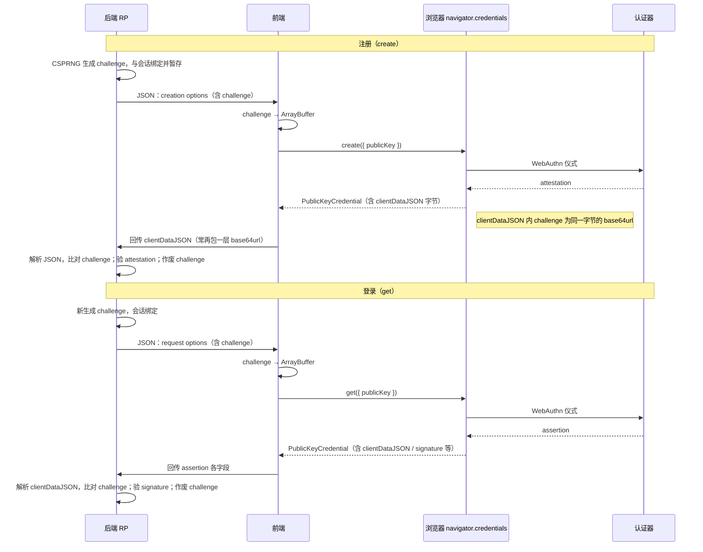

# 通行密钥字段编码与前后端处理教程

> 字节字段传输使用 base64；存储到本地要转 `ArrayBuffer`。

## 整体实现思路

通行密钥这件事，最容易出错的地方不是 API 调用本身，而是字段的「语义」和「编码」混在了一起。WebAuthn 里的很多字段在浏览器侧最终都要求是字节，但为了走 JSON，服务端往往会把它们包装成字符串。

最稳的实现不是「看到字符串就猜它是 base64 还是文本」，而是按字段语义固定转换：`user.id` 和 `challenge` 可以是原始文本也可以是 base64url，但 credential id 一类字段本质上是二进制标识，JSON 里通常应以 base64url 传输。`user.id` 本身是 RP 自定义的不透明字节序列；认证时返回的 `userHandle` 对应注册时的这个值，且 discoverable credentials 下必须被填充。（W3C）

你这次遇到的 `2539261` → `2539260`，根因不是「WebAuthn 会改 ID」，而是把原始文本 `2539261` 错当成了 base64/base64url 去解码。像 `tryToBuf` 这种「先试 base64url，失败再回退文本」的函数，在 WebAuthn 里是高风险的：纯数字字符串也满足 base64 字符集，误解码后再编码就会被规范化成别的字符串。这个坑一旦发生在注册阶段，错误的 `userHandle` 会被写进认证器里，后面只改前端代码并不会自动修正旧凭证。这个结论来自你当前代码行为本身。

## 先把字段分成 4 类

### 1）注册请求：后端给前端，前端喂给 `navigator.credentials.create()`

这里最关键的字段是：

- **challenge**：根据是原始文本还是 base64 来转 buffer
- **rp.id** / **rp.name**：不用转
- **user.id** ：根据是原始文本还是 base64 来转 buffer。user.name，user.displayName不用
- **pubKeyCredParams**
- **excludeCredentials[].id**：根据是原始文本还是 base64 来转 buffer

其中真正需要「字节转换」的，主要是：

- challenge
- user.id
- excludeCredentials[].id

而 `rp.id`、`name`、`displayName` 这些是普通字符串，不做字节转换。`user.id` 要求是 `BufferSource`，本质是不透明字节序列；`challenge` 也是由服务端提供给创建流程使用的字节值。（MDN Web Docs）

### 2）注册响应：前端拿到 `PublicKeyCredential` 后回传后端

这里常见字段是：

- **id**，已经是 base64，不要再转
- **rawId**，需要 `arrayBufferToB64url`
- **response.clientDataJSON**，需要 `arrayBufferToB64url`
- **response.attestationObject**，需要 `arrayBufferToB64url`

`rawId` 是原始二进制 credential id；`id` 是它的 base64url 字符串表示。由浏览器已经处理好；前端回传时，通常会把这些二进制字段统一转成 base64url 再发后端。`id` 已经是 base64，就不要再转了。（MDN Web Docs）

### 3）登录请求：后端给前端，前端喂给 `navigator.credentials.get()`

这里最关键的字段是：

- **challenge**：根据是原始文本还是 base64 来转 buffer
- **rpId**
- **allowCredentials[].id**：根据是原始文本还是 base64 来转 buffer

需要做字节转换的主要是：

- challenge
- allowCredentials[].id

`allowCredentials[].id` 对应的是已注册凭证的 credential id，它不是普通文本，而是二进制 ID 的 JSON 表示，因此应按 base64url 还原为字节。（MDN Web Docs）

### 4）登录响应：前端拿到 assertion 后回传后端

这里常见字段是：

- **id**：已经是 base64，不要再转
- **rawId**：需要 `arrayBufferToB64url`
- **response.clientDataJSON**：需要 `arrayBufferToB64url`
- **response.authenticatorData**：需要 `arrayBufferToB64url`
- **response.signature**：需要 `arrayBufferToB64url`
- **response.userHandle**：需要 `arrayBufferToB64url`

总结就是除 `id` 都要转，特别是 `response` 下的。

`userHandle` 是认证器返回的用户句柄，对应注册时的 `user.id`。它是一个不透明标识，可以为 `null`；但 discoverable credentials 下必须被填充。（MDN Web Docs）

## `challenge` 在注册与登录里是怎么被用上的

`challenge` 是**本次 WebAuthn 仪式（ceremony）绑定的、由 RP 生成的随机字节**。它不直接等于「用户密码」，而是让**这一次**的 `create` / `get` 与**这一次**的后端会话对应起来，并参与后续密码学校验，用来缓解重放：攻击者即使截获过旧的 `clientDataJSON`，里面的 `challenge` 也应对不上你服务器当下只承认的那一条。

下面按**注册**和**登录**各走一遍，并标出**后端、前端、浏览器 API**三侧各自做什么。

### 注册（Registration）

| 环节           | 谁                    | 做什么                                                                                                                                                                                                                                                                                                                                                                                                                                                                                                                                                                           |
| -------------- | --------------------- | -------------------------------------------------------------------------------------------------------------------------------------------------------------------------------------------------------------------------------------------------------------------------------------------------------------------------------------------------------------------------------------------------------------------------------------------------------------------------------------------------------------------------------------------------------------------------------- |
| 生成与下发     | **后端**              | 用 CSPRNG 生成足够长度的随机 `challenge`（常见库会帮你做）；把它和当前用户会话（或一次性 token）绑定并**暂存**（内存、Redis、加密 cookie 等，按你架构来）；放进 `PublicKeyCredentialCreationOptions.challenge`，序列化成 JSON 给前端。                                                                                                                                                                                                                                                                                                                                           |
| 入参           | **前端**              | 把 JSON 里的 `challenge` 转成 `ArrayBuffer`（你们约定用 `textToArrayBuffer` 或 `b64urlToArrayBuffer`，与后端下发格式一致），填入 `publicKey.challenge`，调用 **`navigator.credentials.create({ publicKey })`**（Credential Management API 上的 WebAuthn 入口）。                                                                                                                                                                                                                                                                                                                 |
| 浏览器与认证器 | **浏览器 / WebAuthn** | 校验选项、拉起认证器；在内部构造 **`clientDataJSON`**（UTF-8 的 JSON 文本）。其中会有一个 **`challenge` 字段**，值为**对「你传进来的那个 challenge 字节」做 base64url 编码后的字符串**（注意：这是 JSON 里的字符串形态，和你在 `PublicKeyCredentialCreationOptions` 里传的 `BufferSource` 是同一语义，编码层级不同）。`type` 为 `webauthn.create`，还会带上 `origin` 等。认证器侧会把 `clientDataJSON` 的哈希写进 attestation 相关数据里，最终你拿到的是 **`PublicKeyCredential`**，其 `response.clientDataJSON` / `response.attestationObject` 等是二进制，需再编码回传给后端。 |
| 校验与作废     | **后端**              | 收到注册结果后，解析 **`clientDataJSON`**（先 base64url 解码成 UTF-8 字符串再 `JSON.parse`），取出其中的 **`challenge`**，与**当初下发且仍绑定本会话**的那条做**常量时间比较**；同时检查 `type`、`origin`（以及后续对 `attestationObject` 的验签、信任链等）。**校验通过后应丢弃该 challenge**，避免重复使用。                                                                                                                                                                                                                                                                   |

要点：**你在 `create()` 里喂给浏览器的 `challenge` 是「字节」；回包里的 `clientDataJSON` 里再次出现的是「同一挑战」在 JSON 里的 base64url 表示。** 后端比对的是解析 `clientDataJSON` 之后拿到的那个值，与「你会话里存的那份」是否一致。

### 登录（Authentication）

| 环节           | 谁                    | 做什么                                                                                                                                                                                                                                                          |
| -------------- | --------------------- | --------------------------------------------------------------------------------------------------------------------------------------------------------------------------------------------------------------------------------------------------------------- |
| 生成与下发     | **后端**              | 同样生成并会话绑定 `challenge`，放进 `PublicKeyCredentialRequestOptions.challenge`，JSON 给前端。                                                                                                                                                               |
| 入参           | **前端**              | 转成 `ArrayBuffer` 后调用 **`navigator.credentials.get({ publicKey })`**（可选 `mediation`、`allowCredentials` 等，与本文编码主题无关）。                                                                                                                       |
| 浏览器与认证器 | **浏览器 / WebAuthn** | 构造 **`clientDataJSON`**，其中 `type` 为 `webauthn.get`，**`challenge` 字段**同样是对本次字节 challenge 的 base64url；认证器对 **authenticatorData** 与 **clientDataJSON 的 SHA-256** 等参与签名，得到 `response.signature`、`response.authenticatorData` 等。 |
| 校验与作废     | **后端**              | 解析 **`clientDataJSON`**，比对 **`challenge`** 与会话中存储的值；校验 `type`、`origin`；再用存库的公钥验 **`signature`**。**通过后同样应作废该 challenge。**                                                                                                   |

### 和本文其它约定的关系

- **请求阶段**（后端 → 前端 → `create` / `get`）：你在 `PublicKeyCredentialCreationOptions` / `PublicKeyCredentialRequestOptions` 里设置的 `challenge`，在浏览器类型里是 **`BufferSource`**，所以前端必须做「字符串 / base64url → `ArrayBuffer`」这一步；传错字节等于绑错了「这一次仪式」，后端按 `clientDataJSON` 比对时会失败，或更糟时在其它字段上掩盖问题。
- **响应阶段**：`challenge` **不会**再单独作为一个顶层字段回给你；它体现在 **`response.clientDataJSON` 解码后的 JSON** 里。因此全文说的「`clientDataJSON` 要 `arrayBufferToB64url` 回传后端」正是为了让服务端能解码并做上述比对与联动的验签。

### 一眼看完：`challenge` 在这条链上的形态



### 规范里比对的是什么（避免「存了 A 却比 B」）

W3C 的 **Collected Client Data** 里，`challenge` 的类型是 **base64url 字符串**，语义上等于 **「RP 在 options 里给出的那串 challenge 字节」再做 base64url**（与你在 `PublicKeyCredentialCreationOptions` / `PublicKeyCredentialRequestOptions` 里传入的 `BufferSource` 一致）。因此后端验证时，应使用**与当初生成时相同的字节序列**去比较：要么把会话里存的 bytes 编码成 base64url 再与 JSON 里的字符串比，要么把 JSON 里的 `challenge` 用 base64url **解码成 bytes** 再与内存里存的 bytes 做常量时间比较；**不要**一边用「随机二进制」、另一边却用 `textToArrayBuffer(某字符串)` 造出一组不同字节，否则仪式还没走到验签就会失败。

### 和浏览器 API 名称对齐（查文档时好用）

- **入口**：[`navigator.credentials.create()`](https://developer.mozilla.org/docs/Web/API/CredentialsContainer/create) / [`navigator.credentials.get()`](https://developer.mozilla.org/docs/Web/API/CredentialsContainer/get)，属于 **Credential Management API**；传入 `publicKey` 分支时由 **Web Authentication**（WebAuthn）处理。
- **返回值类型**：成功时一般是 **`PublicKeyCredential`**，其 `response` 在注册侧为 **`AuthenticatorAttestationResponse`**，在登录侧为 **`AuthenticatorAssertionResponse`**；二者都带 **`clientDataJSON`**（`ArrayBuffer`），其中的 challenge 需在 UTF-8 解码后的 JSON 里读取。

## 按你们现在这套约定，用这 3 个

- 原始文本 → `ArrayBuffer`：`textToArrayBuffer`
- base64url 字符串 → `ArrayBuffer`：`b64urlToArrayBuffer`
- `ArrayBuffer` → base64url 字符串：`arrayBufferToB64url`

对应你们当前场景：

- **challenge**（后端给原始文本）→ `textToArrayBuffer`
- **user.id**（后端给原始文本）→ `textToArrayBuffer`
- **allowCredentials[].id** / **excludeCredentials[].id**（credential id）→ `b64urlToArrayBuffer`
- **rawId** / **clientDataJSON** / **attestationObject** / **authenticatorData** / **signature** / **userHandle** 回传后端 → `arrayBufferToB64url`

用这 3 个就够了，直接替换/新增这几个方法：

```ts
// 原始文本（如你们当前的 challenge、user.id）固定按 UTF-8 文本转字节
export const textToArrayBuffer = (value: string | number): ArrayBuffer => {
  return new TextEncoder().encode(String(value)).buffer as ArrayBuffer;
};

// base64url 字符串（如 allowCredentials[].id / excludeCredentials[].id）转字节
export const b64urlToArrayBuffer = (b64url: string): ArrayBuffer => {
  if (!b64url || typeof b64url !== "string") {
    throw new Error("Invalid base64url input");
  }
  const cleanInput = b64url.trim();
  // 长度模 4 等于 1 时，不可能是合法的 base64/base64url
  if (cleanInput.length % 4 === 1) {
    throw new Error("Invalid base64url input length");
  }
  // 统一把 base64url 转成标准 base64，并补齐 '='
  const pad = "=".repeat((4 - (cleanInput.length % 4)) % 4);
  const base64 = (cleanInput + pad).replace(/-/g, "+").replace(/_/g, "/");
  const raw = atob(base64);
  const buf = new ArrayBuffer(raw.length);
  const view = new Uint8Array(buf);
  for (let i = 0; i < raw.length; i++) {
    view[i] = raw.charCodeAt(i);
  }
  return buf;
};

// 浏览器返回的二进制字段（如 rawId、clientDataJSON、signature）转 base64url 字符串，便于回传后端
export const arrayBufferToB64url = (buf: ArrayBuffer): string => {
  const bytes = new Uint8Array(buf);
  let binary = "";
  for (let i = 0; i < bytes.length; i++) {
    binary += String.fromCharCode(bytes[i]);
  }
  return btoa(binary)
    .replace(/\+/g, "-")
    .replace(/\//g, "_")
    .replace(/=+$/g, "");
};
```

### 对应使用规则

```ts
// challenge / user.id（后端给原始文本）
textToArrayBuffer(value);

// allowCredentials[].id / excludeCredentials[].id（后端给 base64url）
b64urlToArrayBuffer(value);

// rawId / clientDataJSON / attestationObject / authenticatorData / signature / userHandle 回传后端
arrayBufferToB64url(buffer);
```

`tryToBuf` 不要再用于这些通行密钥核心字段。
