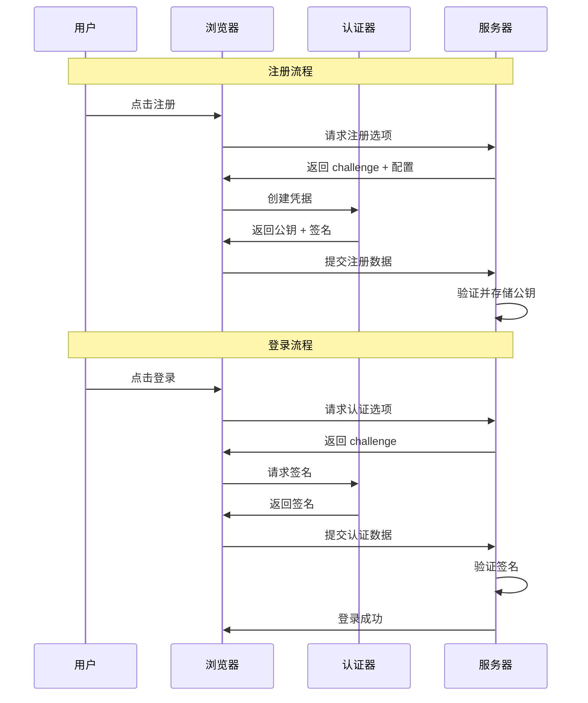

# 通行密钥完整指南：从基础到实战

> 本指南将通行密钥（Passkeys）从基础概念到高级应用进行分层讲解，帮助开发者快速掌握并落地实现。

## 目录

1. [基础概念](#基础概念)
2. [核心配置详解](#核心配置详解)
3. [实战应用场景](#实战应用场景)
4. [高级特性与扩展](#高级特性与扩展)
5. [常见问题与最佳实践](#常见问题与最佳实践)

---

## 基础概念

### 什么是通行密钥（Passkeys）？

通行密钥是基于 WebAuthn 标准的无密码身份认证技术，通过生物识别、PIN 码或硬件安全密钥来验证用户身份。

**核心优势：**

- 🔐 **更安全**：基于公钥密码学，私钥永不离开设备
- 🚀 **更便捷**：无需记忆密码，支持跨设备同步
- 🛡️ **防钓鱼**：每个网站使用不同的密钥对

### 关键术语

| 术语                   | 说明                                             |
| ---------------------- | ------------------------------------------------ |
| **Relying Party (RP)** | 依赖方，即你的网站或应用                         |
| **Authenticator**      | 认证器，执行认证的设备（手机、电脑、安全钥匙等） |
| **Credential**         | 凭据，包含公钥和元数据的认证信息                 |
| **Challenge**          | 挑战，防重放攻击的随机值                         |
| **Attestation**        | 证明，验证认证器来源的可选信息                   |

### 认证流程概览



---

## 核心配置详解

### 1. 注册配置（Registration Options）

#### 基础配置

```typescript
const registrationOptions = await generateRegistrationOptions({
  // 站点信息
  rpName: "我的应用", // 用户可见的站点名称
  rpID: "example.com", // 域名，必须与当前页面匹配

  // 用户信息
  userID: Buffer.from("user-123", "utf8"), // 用户唯一ID（二进制）
  userName: "user@example.com", // 用户名
  userDisplayName: "张三", // 显示名称

  // 安全配置
  challenge: generateChallenge(), // 随机挑战（通常自动生成）
  timeout: 60000, // 超时时间（毫秒）
});
```

#### 算法配置

```typescript
// 支持的算法（按优先级排序）
supportedAlgorithmIDs: [
  -7, // ES256 (ECDSA w/ SHA-256) - 最推荐
  -257, // RS256 (RSA w/ SHA-256) - 兼容性好
  -8, // EdDSA (Ed25519) - 现代算法
];
```

**算法选择建议：**

- **生产环境**：`[-7, -257]`（ES256 + RS256）
- **现代应用**：`[-7, -8]`（ES256 + EdDSA）
- **兼容性优先**：`[-7, -257, -8]`

#### 认证器选择

```typescript
authenticatorSelection: {
  // 认证器类型
  authenticatorAttachment: "platform",     // "platform" | "cross-platform"

  // 可发现凭据（Passkey 核心特性）
  residentKey: "required",                 // "required" | "preferred" | "discouraged"

  // 用户验证要求
  userVerification: "preferred",           // "required" | "preferred" | "discouraged"
}
```

**配置说明：**

| 字段               | 值            | 说明               | 推荐场景     |
| ------------------ | ------------- | ------------------ | ------------ |
| `residentKey`      | `required`    | 必须创建可发现凭据 | Passkey 体验 |
| `residentKey`      | `preferred`   | 优先创建可发现凭据 | 兼容性考虑   |
| `residentKey`      | `discouraged` | 不创建可发现凭据   | 传统认证器   |
| `userVerification` | `required`    | 必须生物识别/PIN   | 高安全场景   |
| `userVerification` | `preferred`   | 优先生物识别       | 通用场景     |
| `userVerification` | `discouraged` | 不要求生物识别     | 低安全场景   |

#### 证明配置

```typescript
attestationType: "none"; // "none" | "direct" | "indirect" | "enterprise"
```

**证明类型说明：**

| 类型         | 说明           | 使用场景           |
| ------------ | -------------- | ------------------ |
| `none`       | 不收集证明信息 | **推荐**，隐私友好 |
| `direct`     | 直接设备证明   | 企业合规要求       |
| `indirect`   | 间接证明       | 很少使用           |
| `enterprise` | 企业级证明     | 特殊企业场景       |

### 2. 登录配置（Authentication Options）

#### 基础配置

```typescript
const authenticationOptions = await generateAuthenticationOptions({
  rpID: "example.com", // 与注册时一致
  challenge: generateChallenge(), // 新的随机挑战
  timeout: 60000, // 超时时间
  userVerification: "preferred", // 用户验证要求
});
```

#### 凭据限制

```typescript
// 方式一：指定用户凭据（传统登录）
allowCredentials: [
  {
    id: Buffer.from("credential-id", "base64url"),
    type: "public-key",
    transports: ["internal", "hybrid", "usb"],
  },
];

// 方式二：可发现凭据（Passkey 直登）
allowCredentials: []; // 空数组或不传
```

**传输方式说明：**

| 传输方式   | 说明           | 使用场景               |
| ---------- | -------------- | ---------------------- |
| `internal` | 平台内置认证器 | 手机指纹、Face ID      |
| `usb`      | USB 安全钥匙   | 硬件安全密钥           |
| `nfc`      | 近场通信       | NFC 安全钥匙           |
| `ble`      | 蓝牙低功耗     | 蓝牙安全钥匙           |
| `hybrid`   | 混合传输       | 跨设备认证（手机扫码） |

### 3. 扩展功能

```typescript
extensions: {
  // 凭据属性
  credProps: true,              // 获取凭据类型信息

  // 大对象存储
  largeBlob: { support: "preferred" },

  // 伪随机函数
  prf: { eval: { first: new Uint8Array(32) } },

  // U2F 兼容
  appid: "https://example.com/u2f-app-id.json"
}
```

---

## 实战应用场景

### 场景一：新用户 Passkey-first 注册

```typescript
// 服务端：生成注册选项
const options = await generateRegistrationOptions({
  rpName: "我的应用",
  rpID: "example.com",
  userID: Buffer.from(userId, "utf8"),
  userName: userEmail,
  userDisplayName: userDisplayName,

  // Passkey 核心配置
  supportedAlgorithmIDs: [-7, -257],
  authenticatorSelection: {
    residentKey: "required", // 必须可发现凭据
    userVerification: "preferred", // 优先生物识别
  },
  attestationType: "none",
  extensions: { credProps: true },
  timeout: 120000,
});

// 前端：创建凭据
const credential = await navigator.credentials.create({
  publicKey: options,
});

// 服务端：验证注册
const verification = await verifyRegistrationResponse({
  response: credential,
  expectedChallenge: options.challenge,
  expectedOrigin: "https://example.com",
  expectedRPID: "example.com",
  requireUserVerification: true,
});
```

### 场景二：无用户名直登（Conditional UI）

```typescript
// 服务端：生成认证选项（不限制凭据）
const options = await generateAuthenticationOptions({
  rpID: "example.com",
  userVerification: "preferred",
  timeout: 120000,
  // allowCredentials 留空，支持可发现凭据
});

// 前端：启用条件式 UI
const credential = await navigator.credentials.get({
  publicKey: options,
  mediation: "conditional", // 关键：启用条件式 UI
});

// 服务端：验证认证
const verification = await verifyAuthenticationResponse({
  response: credential,
  expectedChallenge: options.challenge,
  expectedOrigin: "https://example.com",
  expectedRPID: "example.com",
  authenticator: storedCredential,
  requireUserVerification: true,
});
```

### 场景三：跨设备认证

```typescript
// 构建支持跨设备的凭据列表
function buildAllowCredentials(userCredentials) {
  return userCredentials.map((cred) => ({
    id: Buffer.from(cred.credentialId, "base64url"),
    type: "public-key",
    transports: [
      "internal", // 本机认证器
      "hybrid", // 跨设备认证（手机扫码）
      "usb", // USB 安全钥匙
      "nfc", // NFC 安全钥匙
      "ble", // 蓝牙安全钥匙
    ],
  }));
}

// 生成认证选项
const options = await generateAuthenticationOptions({
  rpID: "example.com",
  allowCredentials: buildAllowCredentials(userCredentials),
  userVerification: "preferred",
  timeout: 120000,
});
```

### 场景四：多凭据管理

```typescript
// 获取用户所有凭据
async function getUserCredentials(userId) {
  return await db.credentials.findMany({
    where: { userId },
    select: {
      credentialId: true,
      publicKey: true,
      counter: true,
      transports: true,
      aaguid: true,
      createdAt: true,
      lastUsedAt: true,
    },
  });
}

// 凭据管理接口
class CredentialManager {
  // 添加凭据
  async addCredential(userId, credentialData) {
    return await db.credentials.create({
      data: {
        userId,
        credentialId: credentialData.credentialId,
        publicKey: credentialData.publicKey,
        counter: credentialData.counter,
        transports: credentialData.transports,
        aaguid: credentialData.aaguid,
      },
    });
  }

  // 删除凭据
  async removeCredential(credentialId) {
    return await db.credentials.delete({
      where: { credentialId },
    });
  }

  // 更新最后使用时间
  async updateLastUsed(credentialId) {
    return await db.credentials.update({
      where: { credentialId },
      data: { lastUsedAt: new Date() },
    });
  }
}
```

---

## 高级特性与扩展

### 1. 设备识别与来源追踪

```typescript
// AAGUID 映射表
const AAGUID_MAP = {
  "ea9b8d66-4d01-1d21-3ce4-b6b48cb575d4": "Google Password Manager",
  "adce0002-35bc-c60a-648b-0b25f1f05503": "Chrome on Mac",
  "08987058-cadc-4b81-b6e1-30de50dcbe96": "Windows Hello",
  "9ddd1817-af5a-4672-a2b9-3e3dd95000a9": "Windows Hello",
  "6028b017-b1d4-4c02-b4b3-afcdafc96bb2": "Windows Hello",
  "fbfc3007-154e-4ecc-8c0b-6e020557d7bd": "iCloud Keychain",
  "00000000-0000-0000-0000-000000000000": "Apple/Unknown",
};

// 识别设备来源
function identifyDeviceSource(aaguid) {
  return AAGUID_MAP[aaguid] || "Unknown";
}

// 在注册验证后记录设备信息
const verification = await verifyRegistrationResponse({...});
const deviceSource = identifyDeviceSource(verification.registrationInfo.aaguid);

await db.credentials.create({
  data: {
    // ... 其他字段
    aaguid: verification.registrationInfo.aaguid,
    deviceSource,
    userAgent: req.headers['user-agent'],
  }
});
```

### 2. 风控与安全策略

```typescript
class SecurityPolicy {
  // 检查用户验证要求
  static shouldRequireUserVerification(operation, riskLevel) {
    if (operation === "login" && riskLevel === "high") {
      return "required";
    }
    if (operation === "sensitive_action") {
      return "required";
    }
    return "preferred";
  }

  // 检查设备信任度
  static isDeviceTrusted(credential, userHistory) {
    const deviceAge = Date.now() - credential.createdAt.getTime();
    const usageCount = userHistory.filter(
      (h) => h.credentialId === credential.credentialId
    ).length;

    return deviceAge > 30 * 24 * 60 * 60 * 1000 && usageCount > 5; // 30天且使用5次以上
  }

  // 生成风险评分
  static calculateRiskScore(context) {
    let score = 0;

    if (context.isNewDevice) score += 30;
    if (context.isNewLocation) score += 20;
    if (context.isUnusualTime) score += 10;
    if (context.hasRecentFailures) score += 25;

    return Math.min(score, 100);
  }
}
```

### 3. 错误处理与降级策略

```typescript
class PasskeyErrorHandler {
  static async handleAuthenticationError(error, context) {
    switch (error.name) {
      case "NotAllowedError":
        if (error.message.includes("timeout")) {
          return { action: "retry", message: "认证超时，请重试" };
        }
        if (error.message.includes("user")) {
          return {
            action: "fallback",
            message: "用户取消，请选择其他登录方式",
          };
        }
        break;

      case "SecurityError":
        if (error.message.includes("rpId")) {
          return {
            action: "fallback",
            message: "域名不匹配，请使用正确的网站",
          };
        }
        break;

      case "NotSupportedError":
        return {
          action: "fallback",
          message: "设备不支持通行密钥，请使用密码登录",
        };

      default:
        return { action: "fallback", message: "认证失败，请使用其他登录方式" };
    }
  }

  // 降级到密码登录
  static async fallbackToPassword(email) {
    // 发送魔法链接或验证码
    const magicLink = await generateMagicLink(email);
    await sendEmail(email, magicLink);
    return { action: "magic_link_sent", message: "已发送登录链接到您的邮箱" };
  }
}
```

### 4. 性能优化

```typescript
class PasskeyOptimizer {
  // 缓存认证选项
  private static optionsCache = new Map();

  static async getCachedOptions(userId, operation) {
    const key = `${userId}:${operation}`;
    const cached = this.optionsCache.get(key);

    if (cached && Date.now() - cached.timestamp < 30000) {
      // 30秒缓存
      return cached.options;
    }

    const options = await this.generateOptions(userId, operation);
    this.optionsCache.set(key, {
      options,
      timestamp: Date.now(),
    });

    return options;
  }

  // 批量验证凭据
  static async batchVerifyCredentials(credentials, expectedChallenge) {
    const promises = credentials.map((cred) =>
      verifyAuthenticationResponse({
        response: cred.response,
        expectedChallenge,
        expectedOrigin: process.env.ORIGIN,
        expectedRPID: process.env.RP_ID,
        authenticator: cred.authenticator,
        requireUserVerification: true,
      }).catch((error) => ({ error, credentialId: cred.credentialId }))
    );

    const results = await Promise.allSettled(promises);
    return results.filter((result) => result.status === "fulfilled");
  }
}
```

---

## 常见问题与最佳实践

### 1. 常见问题

#### Q: 为什么我的通行密钥在某些设备上无法使用？

**A:** 可能的原因：

- 设备不支持 WebAuthn 或版本过低
- 浏览器不支持或未启用相关功能
- 企业策略禁用了通行密钥
- 网络环境限制（如代理、防火墙）

**解决方案：**

```typescript
// 检测设备支持度
async function checkDeviceSupport() {
  const support = {
    webauthn: !!window.PublicKeyCredential,
    conditionalUI:
      await PublicKeyCredential.isConditionalMediationAvailable?.(),
    platformAuthenticator:
      await PublicKeyCredential.isUserVerifyingPlatformAuthenticatorAvailable?.(),
  };

  return support;
}
```

#### Q: 如何处理跨设备同步问题？

**A:** 通行密钥的跨设备同步依赖于平台提供商：

- **Apple**: iCloud Keychain 自动同步
- **Google**: Google Password Manager 同步
- **Microsoft**: Microsoft Account 同步

**最佳实践：**

- 鼓励用户在同一生态系统中使用
- 提供多凭据绑定选项
- 实现跨设备认证（Hybrid 传输）

#### Q: 如何确保安全性？

**A:** 安全最佳实践：

1. **强制用户验证**：设置 `userVerification: "required"`
2. **验证挑战**：确保 challenge 一次性使用
3. **更新计数器**：检查并更新 signCount
4. **设备绑定**：记录设备信息用于风控
5. **多因素认证**：结合其他验证方式

### 2. 最佳实践

#### 用户体验优化

```typescript
// 渐进式增强
class ProgressiveEnhancement {
  static async enhanceLoginForm() {
    const support = await checkDeviceSupport();

    if (support.webauthn) {
      // 显示通行密钥选项
      this.showPasskeyOption();

      if (support.conditionalUI) {
        // 启用自动填充
        this.enableAutofill();
      }
    } else {
      // 降级到传统登录
      this.showTraditionalLogin();
    }
  }

  static showPasskeyOption() {
    const passkeyButton = document.createElement("button");
    passkeyButton.textContent = "使用通行密钥登录";
    passkeyButton.onclick = this.handlePasskeyLogin;
    document.querySelector(".login-form").appendChild(passkeyButton);
  }
}
```

#### 错误处理

```typescript
// 统一错误处理
class UnifiedErrorHandler {
  static handle(error, context) {
    const errorInfo = {
      name: error.name,
      message: error.message,
      timestamp: new Date().toISOString(),
      context,
    };

    // 记录错误
    console.error("Passkey Error:", errorInfo);

    // 用户友好提示
    const userMessage = this.getUserFriendlyMessage(error);

    // 降级策略
    if (this.shouldFallback(error)) {
      return this.initiateFallback(context);
    }

    return { error: userMessage };
  }

  static getUserFriendlyMessage(error) {
    const messages = {
      NotAllowedError: "认证被取消或超时",
      SecurityError: "安全验证失败",
      NotSupportedError: "设备不支持通行密钥",
      InvalidStateError: "认证器状态无效",
      ConstraintError: "认证器约束不满足",
    };

    return messages[error.name] || "认证失败，请重试";
  }
}
```

#### 性能优化

```typescript
// 性能监控
class PerformanceMonitor {
  static async measureOperation(operation, fn) {
    const start = performance.now();

    try {
      const result = await fn();
      const duration = performance.now() - start;

      // 记录性能指标
      this.recordMetric(operation, duration, "success");

      return result;
    } catch (error) {
      const duration = performance.now() - start;

      // 记录错误指标
      this.recordMetric(operation, duration, "error");

      throw error;
    }
  }

  static recordMetric(operation, duration, status) {
    // 发送到监控系统
    analytics.track("passkey_operation", {
      operation,
      duration,
      status,
      timestamp: Date.now(),
    });
  }
}
```

### 3. 部署检查清单

#### 开发环境

- [ ] 使用 HTTPS（localhost 除外）
- [ ] 配置正确的 rpID
- [ ] 实现 challenge 生成和验证
- [ ] 设置合适的超时时间
- [ ] 启用用户验证

#### 生产环境

- [ ] 配置正确的域名和 rpID
- [ ] 实现错误处理和降级策略
- [ ] 设置监控和日志
- [ ] 配置备份和恢复机制
- [ ] 进行安全审计

#### 用户体验

- [ ] 提供清晰的说明和引导
- [ ] 实现渐进式增强
- [ ] 支持多设备绑定
- [ ] 提供凭据管理功能
- [ ] 实现跨设备认证

---

## 总结

通行密钥是未来身份认证的重要方向，通过本指南的分层讲解，你应该能够：

1. **理解基础概念**：掌握 WebAuthn 和 Passkeys 的核心原理
2. **配置正确参数**：根据场景选择合适的配置选项
3. **实现实战应用**：构建完整的注册和登录流程
4. **处理高级特性**：实现设备识别、风控和安全策略
5. **遵循最佳实践**：优化用户体验和系统性能

记住，通行密钥的成功实施需要前后端的紧密配合，以及良好的用户体验设计。始终以用户为中心，提供安全、便捷的认证体验。

---

## 参考资源

- [WebAuthn 规范](https://www.w3.org/TR/webauthn-3/)
- [SimpleWebAuthn 文档](https://simplewebauthn.dev/)
- [Passkeys 开发者指南](https://developers.google.com/identity/passkeys)
- [Apple Passkeys 文档](https://developer.apple.com/passkeys/)
- [FIDO Alliance 资源](https://fidoalliance.org/passkeys/)
